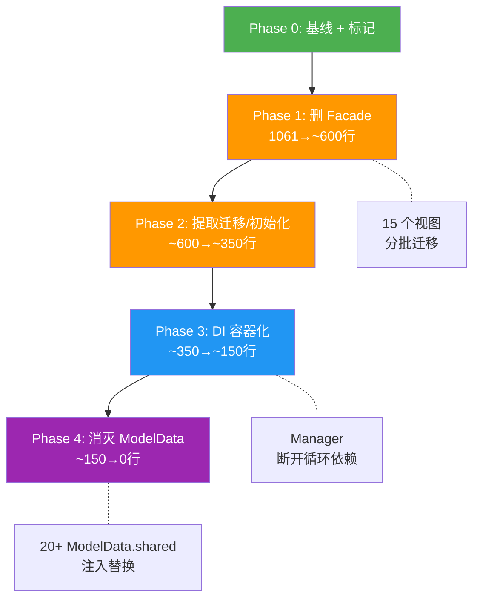

# ModelData 消灭计划

> 目标: 将 ModelData (1,061 行) 从 God Object → 薄壳 → 最终消灭
> 日期: 2026-06-24

---

## 一、当前 ModelData 解剖

### 1,061 行按职责分类

| 类别 | 行数 | 占比 | 内容 |
|------|------|------|------|
| **Realm 迁移逻辑** | ~220 | 21% | `tryInitializeDatabase` 中 schema v42→v140 的迁移块 |
| **Facade 转发方法** | ~180 | 17% | 无逻辑，纯转发到 Manager/Service (如 `func addToShelf { bookManager.addToShelf }`) |
| **Facade 委托属性** | ~80 | 8% | 无逻辑，纯转发 get/set (如 `var booksInShelf { get { bookManager.booksInShelf } }`) |
| **DI 容器 (lazy var)** | ~30 | 3% | Repository/Manager/Service 实例创建 (L158-183) |
| **数据库初始化** | ~60 | 6% | `initializeDatabase`, `migrateLegacyReadPosData` |
| **Combine 管道** | ~60 | 6% | `objectWillChange` 转发, `registerSyncServerHelperConfigCancellable` |
| **Subjects/Published** | ~30 | 3% | `bookImportedSubject`, `calibreUpdatedSubject`, `updatingMetadata` 等 |
| **Realm 实例管理** | ~15 | 1% | `realm`, `realmConf`, `realmSaveBooksMetadata` |
| **Mock/Preview 代码** | ~70 | 7% | `init(mock:)` 中的模拟数据创建 |
| **Kingfisher 配置** | ~5 | <1% | `kfImageCache`, `AuthPlugin` |
| **业务方法 (有逻辑)** | ~80 | 8% | `refreshShelfMetadataV2`, `updateServerLibraryInfo`, `registerSyncServerHelperConfig...` |
| **协议实现** | ~20 | 2% | `LibraryResolver`, `ServerResolver`, `LibraryProvider`, `CalibreServerConfigProvider` |
| **其它** | ~30 | 3% | `getCustomDictViewer`, `deviceName`, `fontsManager` 转发 |

### 关键发现

1. **~25% (260 行) 是纯 Facade 转发** — 没有任何逻辑，仅 `{ manager.xxx }` 
2. **~21% (220 行) 是 Realm 迁移** — 应独立为 `DatabaseMigrator`
3. **只有 ~8% (80 行) 包含真正的业务逻辑** — 可迁移到 Manager
4. **`ModelData.shared` 被 20+ 处引用** — 单例访问是最大的迁移障碍
5. **15 个视图文件使用 `@EnvironmentObject var modelData`** — SwiftUI 注入点
6. **62 个文件总共引用 `ModelData`** — 影响范围很大

---

## 二、消灭策略：四阶段渐进


---

### Phase 0: 准备工作 (~0.5 天)

**状态**: ✅ 已完成 (2026-06-24)

**产出**:
- `.agents/memory-bank/modeldata-baseline-2026-06-24.md` — 精确基线
- `ModelData.swift` 中 84 个 Facade 方法/属性添加 `// FACADE: <Manager>` 标记
- `ModelData.swift` 中 10 个非 Facade 方法添加 `// → <TargetManager>` 标记
- 4 处 force-unwrap 已修复 (`realm`, `realmSaveBooksMetadata`, `realmConf`, `logger`)
- `xcodebuild build` 通过；测试 2 个预存失败 (`ReadingSessionManagerTests`, `ShelfDisplayModelsTests`) 与本次改动无关

#### 0a. 建立 ModelData 瘦身指标基线

**实际基线 (2026-06-24)**:
- `ModelData.swift` 总行数: **1,073** (vs 计划估算 1,061)
- 方法数: **82** (vs 计划估算 ~50)
- 顶层属性数: **29** (vs 计划估算 ~80 — 计划包含 @Published 和 lazy var)
- `ModelData.shared` 生产引用: **41** 处 (vs 计划估算 20+)
- 测试引用: **25** 处
- Facade 引用密度: bookManager 41, serverManager 23, libraryManager 22, sessionManager 23, downloadManager 8, fontsManager 6, logger 3

#### 0b. 标记所有纯 Facade 转发

已完成 84 个 `// FACADE: <Manager>` 标记和 10 个 `// → <TargetManager>` 标记。

---

### Phase 1: 消除 Facade 转发层 (~2 天)

**目标**: 1,061 → ~600 行。让调用者直接访问 Manager/Service。

**状态**: ✅ 已完成 (2026-06-24)

**产出**:
- ModelData.swift 从 **1,172 → 763 行** (减少 409 行, 35% 缩减)
- 删除 **84 个 FACADE 标记** (60+ 转发方法 + 18+ 转发属性)
- 保留 **5 个 `// →` 标记的非 Facade 方法** (Phase 2 处理) 和 6 个 **协议一致性计算属性**
- 迁移了 **30+ ViewModels/Views/Managers** 改用 `modelData.xxxManager.xxx` 模式
- 测试同步更新 (10 个测试文件)

#### 1a. Manager 公开化

**实施**: ViewModel 保持 `let modelData: ModelData`，但所有内部访问改为 `modelData.xxxManager.xxx` 模式。

```swift
// 之前
modelData.addToShelf(book: book, formats: formats)

// 之后
modelData.bookManager.addToShelf(book: book, formats: formats)
```

#### 1b. 批量删除 Facade 转发方法 ✅

删除 60+ 转发方法，约 **300 行**：
- `bookManager`: 24 方法 (`addToShelf`, `removeFromShelf`, `clearCache`, `queryBookRealm`, `getBook`, 等)
- `serverManager`: 12 方法 (`probeServersReachability`, `isServerReachable`, `addServer`, 等)
- `libraryManager`: 12 方法 (`populateLibraries`, `hideLibrary`, `syncLibrary`, 等)
- `sessionManager`: 11 方法 (`getPreferredFormat`, `prepareBookReading`, 等)
- `fontsManager`: 3 方法 (`importCustomFonts`, 等)
- `downloadManager`: 4 方法 (`startDownloadFormatNew`, 等)
- `logger`: 3 方法 (`logStartCalibreActivity`, 等)

#### 1c. 批量删除 Facade 委托属性 ✅

删除 18 转发属性，约 **80 行**：
- `calibreServers`, `calibreLibraries`, `calibreServerInfoStaging`, `calibreLibraryInfoStaging`
- `localLibrary`, `documentServer`
- `defaultFormat`, `formatReaderMap`, `formatList`
- `booksInShelf`, `booksAnnotation`, `currentBookId`, `selectedBookId`
- `readingBookInShelfId`, `readingBook`, `readerInfo`, `presentingEBookReaderFromShelf`, `selectedPosition`
- `librarySyncStatus`, `userFontInfos`

#### 1d. 调用者迁移 ✅

迁移 30+ 文件：
- 5 个 ViewModels (Settings, Server, BookDetail, ReadingPosition, RecentShelf, SectionShelf, Main, Library, ReaderOptions, LibraryInfo)
- 15+ Views (SettingsView, ServerDetailView, AddModServerView, LibraryDetailView, BookPreviewView, ReadingPositionHistoryView, ReadingPositionDetailView, ReaderOptionsView, AppInfoView, RecentShelfView, LibraryInfoView, LibraryInfoBookListView, LibraryInfoBookListContent, etc.)
- 5 Managers (CalibreLibraryManager, CalibreServerManager, ReadingSessionManager, CalibreBookManager, BookDownloadManager)
- 10+ Test files

#### 1e. 协议一致性保留 ✅

为 `CalibreServerConfigProvider` 和 `LibraryProvider` 协议保留 6 个计算属性 (calibreLibraries, calibreServers, librarySyncStatus, calibreServerInfoStaging, booksInShelf, booksAnnotation) 作为薄包装，**仅用于协议一致性**。所有内部调用应直接访问底层 manager。

#### 1f. 类型检查修复 (附带) ✅

修复了 `ShelfDataManager.swift` 中的预存 Swift 类型检查超时问题（拆分了 `map` 闭包为辅助方法 `buildShelfBookItem`）。

#### Phase 1 实际产出: ModelData 从 1,172 → 763 行 (-35%)

---

### Phase 2: 提取数据库初始化与迁移 (~1.5 天)

**目标**: ~600 → ~350 行。将 Realm 相关职责独立。

#### 2a. 提取 DatabaseMigrator

将 `tryInitializeDatabase` 中的 220 行迁移代码提取到独立类：

```swift
// Models/DatabaseMigrator.swift (新建, ~250 行)
final class DatabaseMigrator {
    static let currentSchemaVersion: UInt64 = 140
    
    func makeConfiguration(statusHandler: @escaping (String) -> Void) throws -> Realm.Configuration {
        // 包含所有 schema v42→v140 的迁移块
        // 包含 shouldCompactOnLaunch 逻辑
        // 包含文件路径设置 (applicationSupportURL)
    }
}
```

**ModelData 改造**:
```swift
func tryInitializeDatabase(statusHandler: @escaping (String) -> Void) throws {
    let migrator = DatabaseMigrator()
    realmConf = try migrator.makeConfiguration(statusHandler: statusHandler)
    Realm.Configuration.defaultConfiguration = realmConf
}
```

#### 2b. 提取 DatabaseBootstrapper

将 `initializeDatabase()` + `migrateLegacyReadPosData()` 提取：

```swift
// Models/DatabaseBootstrapper.swift (新建, ~80 行)
final class DatabaseBootstrapper {
    func bootstrap(
        realmConf: Realm.Configuration,
        databaseService: DatabaseService,
        serverManager: CalibreServerManager,
        libraryManager: CalibreLibraryManager,
        bookManager: CalibreBookManager,
        downloadManager: BookDownloadManager,
        readingPositionRepository: ReadingPositionRepositoryProtocol
    ) -> (Realm, CalibreActivityLogger) {
        // initializeDatabase 逻辑
        // migrateLegacyReadPosData 逻辑
    }
}
```

#### 2c. 删除 Mock 代码

`init(mock:)` 中的 70 行模拟数据创建可移到测试 fixture：

```swift
// YetAnotherEBookReaderTests/TestHelpers/TestFixtures.swift
extension TestFixtures {
    static func populateModelDataWithMockBook(_ modelData: ModelData) { ... }
}
```

#### 2d. 移动 `registerSyncServerHelperConfigCancellable`

这个 ~50 行的 Combine 管道属于 `CalibreServerManager` 的职责：

```swift
// CalibreServerManager 中添加
func registerSyncServerHelperConfigCancellable(
    syncSubject: PassthroughSubject<String, Never>,
    calibreServerService: CalibreServerService
) { ... }
```

**Phase 2 预期**: ModelData 从 ~600 → ~350 行

---

### Phase 3: DI 容器化 (~2 天)

**目标**: ~350 → ~150 行。将 ModelData 转变为纯 DI 容器。

#### 3a. 引入 AppContainer 协议

```swift
// Models/AppContainer.swift (新建)
protocol AppContainerProtocol: AnyObject {
    // Repositories
    var serverRepository: ServerRepositoryProtocol { get }
    var libraryRepository: LibraryRepositoryProtocol { get }
    var bookRepository: BookRepositoryProtocol { get }
    var readingPositionRepository: ReadingPositionRepositoryProtocol { get }
    var annotationRepository: AnnotationRepositoryProtocol { get }
    var readerPreferenceRepository: ReaderPreferenceRepositoryProtocol { get }
    
    // Managers
    var serverManager: CalibreServerManager { get }
    var libraryManager: CalibreLibraryManager { get }
    var bookManager: CalibreBookManager { get }
    var sessionManager: ReadingSessionManager { get }
    var downloadManager: BookDownloadManager { get }
    var fontsManager: FontsManager { get }
    
    // Services
    var calibreServerService: CalibreServerService { get }
    var unifiedSearchService: UnifiedSearchService { get }
    var unifiedCategoryService: UnifiedCategoryService { get }
    
    // Database
    var databaseService: DatabaseService { get }
    var isDatabaseReady: Bool { get }
    
    // App-wide events
    var calibreUpdatedSubject: PassthroughSubject<calibreUpdatedSignal, Never> { get }
    var bookImportedSubject: PassthroughSubject<BookImportInfo, Never> { get }
}
```

#### 3b. ModelData 瘦身为 AppContainer 实现

```swift
// 精简后的 ModelData (~150 行)
final class ModelData: ObservableObject, AppContainerProtocol {
    static var shared: ModelData?
    
    // === DI: Repositories ===
    lazy var serverRepository: ServerRepositoryProtocol = ...
    lazy var libraryRepository: LibraryRepositoryProtocol = ...
    // ... (30 行)
    
    // === DI: Managers ===
    lazy var serverManager = CalibreServerManager(...)
    // ... (15 行)
    
    // === DI: Services ===
    lazy var calibreServerService = CalibreServerService(...)
    // ... (15 行)
    
    // === App Events ===
    let calibreUpdatedSubject = PassthroughSubject<...>()
    // ... (10 行)
    
    // === Initialization ===
    init() {
        let migrator = DatabaseMigrator()
        // ... minimal setup (30 行)
    }
    
    // === objectWillChange forwarding ===
    private func setupChangeForwarding() { ... }  // 20 行
}
```

#### 3c. 迁移 `ModelData.shared` 引用

| 消费者类型 | 当前 | 改造 |
|-----------|------|------|
| Views (`@EnvironmentObject`) | `modelData.xxx` | `modelData.bookManager.xxx` (Phase 1 已改) |
| ViewModels | `modelData: ModelData` | `container: AppContainerProtocol` 或直接注入 Manager |
| Managers | `modelData: ModelData` | 注入具体依赖（Repository/Service） |
| Adapters (`ModelData.shared`) | `ModelData.shared?.annotationRepository` | 注入 Repository |
| `CalibreCoreModels.swift` | `ModelData.shared` (3 处) | 改为方法参数传入 |

**Phase 3 预期**: ModelData 从 ~350 → ~150 行 (纯 DI 容器 + change forwarding)

---

### Phase 4: 最终消灭 (~3 天)

**目标**: 完全移除 ModelData 类型。

#### 4a. 替换 `@EnvironmentObject var modelData`

**方案 A (iOS 15 兼容)**: 用 `@EnvironmentObject var container: AppContainer` 替换

```swift
// YetAnotherEBookReaderApp.swift
@StateObject var container = AppContainer()

var body: some Scene {
    WindowGroup {
        MainView()
            .environmentObject(container)
    }
}
```

**方案 B (iOS 17+)**: 用 `@Observable class AppContainer` + `@Environment`

```swift
@Observable
final class AppContainer {
    // 所有 Manager/Service/Repository
}

// 视图中
@Environment(AppContainer.self) var container
```

#### 4b. 断开 Manager ↔ ModelData 循环依赖

当前所有 Manager 都持有 `modelData: ModelData` 反向引用，主要用于：

| Manager | 使用 `modelData` 的原因 | 替代方案 |
|---------|----------------------|---------|
| `CalibreBookManager` | 访问 `calibreLibraries`, `calibreServers` | 注入 `LibraryProvider`, `ServerProvider` 协议 |
| `CalibreLibraryManager` | 访问 `calibreServers`, `calibreServerService` | 注入协议 |
| `CalibreServerManager` | 访问 `calibreServerService` | 注入 `CalibreServerService` |
| `ReadingSessionManager` | 访问 `booksInShelf`, `downloadManager` | 注入协议 |

**策略**: 为每个 Manager 的跨域依赖定义轻量协议，而不是传入整个 ModelData。

```swift
// 例: CalibreBookManager 不再需要 ModelData
protocol BookManagerDependencies: AnyObject {
    var calibreLibraries: [String: CalibreLibrary] { get }
    func isServerReachable(server: CalibreServer) -> Bool
}

class CalibreBookManager {
    private weak var dependencies: BookManagerDependencies?
    // 不再需要 modelData
}
```

#### 4c. 消灭 `ModelData.shared`

用依赖注入替换所有 `ModelData.shared` 引用 (当前 20+ 处)：

| 文件 | 改造 |
|------|------|
| `CalibreCoreModels.swift` (3 处) | 改为方法参数 `func getSavedUrl(book:, modelData:)` 或提取为 `BookFileService` |
| `YabrEBookReaderMetaSource.swift` (8 处) | 注入 `annotationRepository` + `readerPreferenceRepository` |
| `YabrReaderNavigationViewModel.swift` (2 处) | 注入 `annotationRepository` |
| `Providers.swift` (3 处) | 注入 `readingPositionRepository` |
| `FolioReaderViewController.swift` (1 处) | 注入 `readingPositionRepository` |
| `ReadingPositionRepository.swift` (1 处) | 移除 `ModelData.shared` fallback |
| `CalibreBookManager.swift` (1 处) | 注入依赖 |

#### 4d. 重命名 + 删除

```swift
// 最终: 删除 ModelData.swift
// AppContainer.swift 成为新的 composition root
// YetAnotherEBookReaderApp.swift 创建 AppContainer
```

**Phase 4 预期**: ModelData.swift 删除，`AppContainer` 成为 ~150 行的纯 DI 容器

---

## 三、依赖关系图



---

## 四、风险与注意事项

### 高风险

1. **`objectWillChange` 转发链**: ModelData 当前转发 4 个 Manager 的 `objectWillChange`。任何依赖 `modelData.objectWillChange` 触发刷新的视图都需要确认替代方案。
2. **`@EnvironmentObject` 全局性**: 15 个视图依赖 ModelData 作为环境对象。Phase 1 中改为 `modelData.bookManager.xxx` 不需要改注入，但 Phase 4 替换类型时需要全部更新。

### 中风险

3. **Manager 循环依赖**: 所有 Manager 持有 `modelData` 反引用。Phase 4 必须先打破循环才能删除 ModelData。
4. **Realm 迁移块的脆弱性**: 220 行迁移代码是历史累积，提取时必须保持语义不变。

### 低风险

5. **Facade 删除是机械性工作**: 只需全局搜索替换调用路径，编译器会捕获所有错误。
6. **Mock 代码移除**: 仅影响 Preview/测试，不影响生产。

---

## 五、每阶段验证标准

```bash
# 每个 Phase 完成后
xcodebuild test -project YetAnotherEBookReader.xcodeproj \
  -scheme YetAnotherEBookReader -sdk iphonesimulator \
  -destination 'platform=iOS Simulator,name=iPhone 17' \
  -derivedDataPath /tmp/YabrDerivedData

# 指标检查
wc -l YetAnotherEBookReader/Models/ModelData.swift
grep -rl "ModelData" YetAnotherEBookReader/ | wc -l
grep -rn "ModelData.shared" YetAnotherEBookReader/ | wc -l
```

---

## 六、总时间线

| Phase | 工作量 | ModelData 行数 | 关键交付物 |
|-------|--------|--------------|-----------|
| 0 | 0.5 天 | 1,061 (不变) | 基线 + 标记 |
| 1 | 2 天 | ~600 | 删除 260 行 Facade, 调用者直接访问 Manager |
| 2 | 1.5 天 | ~350 | `DatabaseMigrator`, `DatabaseBootstrapper` 独立 |
| 3 | 2 天 | ~150 | `AppContainerProtocol`, Manager 依赖协议化 |
| 4 | 3 天 | **0** | ModelData 删除, `AppContainer` 替代 |
| **总计** | **~9 天** | **0** | |

> [!IMPORTANT]
> Phase 1-2 是低风险、高回报的机械性工作，可以随时开始。
> Phase 3-4 涉及架构决策 (iOS 版本要求、DI 方案)，建议在明确 iOS 最低版本后再启动。
> 如果提升到 iOS 17+，`@Observable` 和 `@Environment` 会大幅简化 Phase 4。
