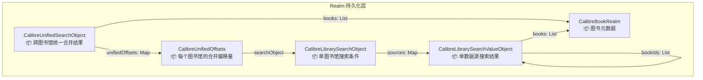
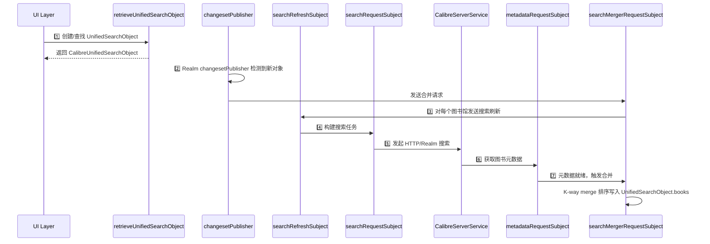
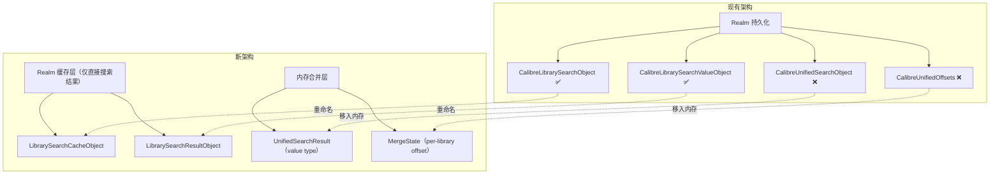
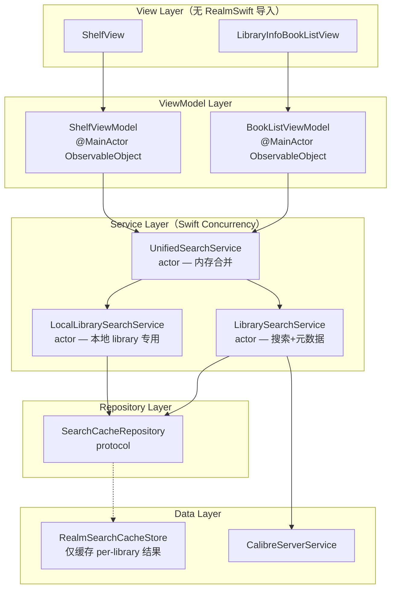

# CalibreUnifiedSearchObject 深度分析与现代化改造方案

## 一、现状分析：数据模型层级

当前搜索子系统使用 5 层 Realm Object 构成一个嵌套的缓存/搜索/合并体系：



### 关键模型定义

| Realm Object | 文件位置 | 作用 | 关键属性 |
|---|---|---|---|
| [CalibreLibrarySearchObject](file:///Users/peterlee/git/YetAnotherEBookReader/YetAnotherEBookReader/Models/CalibreBrowser/CalibreSearchCache.swift#L33-L64) | CalibreSearchCache.swift:33 | 存储单图书馆的搜索条件 | `libraryId`, `search`, `sortBy`, `sortAsc`, `filters`, `sources` |
| [CalibreLibrarySearchValueObject](file:///Users/peterlee/git/YetAnotherEBookReader/YetAnotherEBookReader/Models/CalibreBrowser/CalibreSearchCache.swift#L15-L31) | CalibreSearchCache.swift:15 | 单个数据源的搜索结果 | `generation`, `totalNumber`, `bookIds: List<Int32>`, `books: List<CalibreBookRealm>` |
| [CalibreUnifiedSearchObject](file:///Users/peterlee/git/YetAnotherEBookReader/YetAnotherEBookReader/Models/CalibreBrowser/CalibreSearchCache.swift#L136-L174) | CalibreSearchCache.swift:136 | 跨图书馆统一搜索结果 | `search`, `sortBy`, `filters`, `libraryIds`, `unifiedOffsets`, `books`, `limitNumber`, `totalNumber` |
| [CalibreUnifiedOffsets](file:///Users/peterlee/git/YetAnotherEBookReader/YetAnotherEBookReader/Models/CalibreBrowser/CalibreSearchCache.swift#L118-L134) | CalibreSearchCache.swift:118 | 每个图书馆在合并中的偏移状态 | `offset`, `beenCutOff`, `beenConsumed`, `searchObject`, `searchObjectSource` |
| [CalibreUnifiedSearchRuntime](file:///Users/peterlee/git/YetAnotherEBookReader/YetAnotherEBookReader/Models/CalibreBrowser/CalibreSearchCache.swift#L181-L187) | CalibreSearchCache.swift:181 | 非持久化运行时状态 | `indexMap: [String:Int]`, `objectNotificationToken` |

---

## 二、生命周期完整追踪

### 2.1 触发起点

`CalibreUnifiedSearchObject` 有 **两个创建路径**：

#### 路径 A：UI 驱动（LibraryInfoView）
```
用户操作（搜索/排序/筛选）
  → LibraryInfoView.resetToFirstPage() [L168-180]
  → librarySearchManager.retrieveUnifiedSearchObject() [L1587-1639]
  → 若不存在则创建新对象，写入 Realm
  → viewModel.setUnifiedSearchObject() [L120-158]
```

#### 路径 B：Shelf 驱动（ShelfDataManager）
```
书架添加书籍
  → YabrShelfDataModel.addToShelf() [L137-223]
  → searchManager.retrieveUnifiedSearchObject() [L175-183]
  → 按作者创建 unified search，写入 Realm
```

### 2.2 七阶段响应式数据管线



### 2.3 各阶段详解

#### 阶段 1：创建 — [retrieveUnifiedSearchObject](file:///Users/peterlee/git/YetAnotherEBookReader/YetAnotherEBookReader/Models/CalibreBrowser/CalibreBrowser.swift#L1587-L1639)

```swift
// 三级查找：内存 dict → Realm query → 新建
func retrieveUnifiedSearchObject(...) -> CalibreUnifiedSearchObject {
    // 1. 先查 in-memory dict
    if let objectId = cacheSearchUnifiedObjects[key] {
        return unifiedSearches.where({ $0._id == objectId }).first!  // ⚠️ force unwrap
    }
    // 2. 再查 Realm (复杂的 filter 闭包匹配)
    let existingObjs = unifiedSearches.where { ... }.filter({ object in ... })
    if let cacheObj = existingObjs.first { return cacheObj }
    // 3. 创建新对象（此时 realm == nil，由调用者写入 Realm）
    let cacheObj = CalibreUnifiedSearchObject()
    ...
    return cacheObj
}
```

> [!WARNING]
> **问题**：该方法在 `CalibreLibrarySearchManager`（cacheRealmQueue）和 `YabrShelfDataModel`（dispatchQueue）和 UI（main thread）三个不同线程调用，但没有统一的线程安全保护。

#### 阶段 2：注册监听 — [registerCacheUnifiedSearchObject](file:///Users/peterlee/git/YetAnotherEBookReader/YetAnotherEBookReader/Models/CalibreBrowser/CalibreBrowser.swift#L617-L701)

在 `initCacheStore()` 中通过 `cacheRealm.objects(CalibreUnifiedSearchObject.self).changesetPublisher` 自动检测新插入的对象，然后：
- 注册 `indexMap`（用于快速查找 book 位置）
- 注册 `objectNotificationToken`（监听 `limitNumber` 变更）
- 延迟 5 秒后决定是否需要触发合并

> [!CAUTION]
> **问题**：`asyncAfter(deadline: .now() + 5.0)` 硬编码延迟，无法适应不同网络速度。如果在 5 秒内数据未就绪，合并将在数据到达后由其他 changeset 触发，但时序不可预测。

#### 阶段 3-4：搜索刷新 → 搜索请求 — [registerSearchRefreshReceiver](file:///Users/peterlee/git/YetAnotherEBookReader/YetAnotherEBookReader/Models/CalibreBrowser/CalibreBrowser.swift#L778-L818) + [registerSearchRequestReceiver](file:///Users/peterlee/git/YetAnotherEBookReader/YetAnotherEBookReader/Models/CalibreBrowser/CalibreBrowser.swift#L820-L914)

搜索管线跨 **4 个 DispatchQueue** 执行：

```
searchRefreshSubject → cacheRealmQueue
  → buildLibrarySearchTasks()
  → searchRequestSubject → DispatchQueue.main (loading 计数)
    → cacheWorkerQueue (网络请求)
      → cacheRealmQueue (写结果)
        → DispatchQueue.main (更新 loading 计数)
```

> [!WARNING]
> **问题**：`DispatchQueue.main` 被用来管理 loading 计数（L822, L908），这是因为 `cacheSearchLibraryRuntime` 在 SwiftUI 视图中直接读取（如 [LibraryInfoBookListView:L566](file:///Users/peterlee/git/YetAnotherEBookReader/YetAnotherEBookReader/Views/LibraryInfoView/LibraryInfoBookListView.swift#L566)），将业务逻辑强绑定到了主线程。

#### 阶段 5：网络搜索 — [searchLibraryBooks](file:///Users/peterlee/git/YetAnotherEBookReader/YetAnotherEBookReader/Models/CalibreBrowser/CalibreBrowser.swift#L2005-L2134)

支持两种数据源：
1. **HTTP**: `ajax/search/{libraryKey}` → Calibre Content Server API
2. **Realm 离线**: 本地 `CalibreBookRealm` 查询

> [!NOTE]
> 离线搜索创建了独立的 `Realm(configuration:)` 实例 (L2111)，这意味着每次搜索都会创建新的 Realm 连接，不够高效。

#### 阶段 6：元数据获取 — [registerMetadataRequestReceiver](file:///Users/peterlee/git/YetAnotherEBookReader/YetAnotherEBookReader/Models/CalibreBrowser/CalibreBrowser.swift#L916-L1018)

获取 book metadata 后将 `CalibreBookRealm` 对象追加到 `sourceObj.books` 列表，这会触发 changeset 通知链，最终触发合并。

> [!WARNING]
> **问题**：`task.books.count > 20000` 检查（L922-923）只是打印空字符串，疑似未完成的调试代码。无批次大小限制保护。

#### 阶段 7：K-way 合并 — [mergeBookListsNew](file:///Users/peterlee/git/YetAnotherEBookReader/YetAnotherEBookReader/Models/CalibreBrowser/CalibreBrowser.swift#L1658-L1757)

核心合并算法是一个 **K-way merge sort**，使用 `MergeSortComparatorNew` 比较来自不同图书馆的已排序图书列表：

```swift
// 简化版逻辑：
var heads = [...] // 每个图书馆的当前头部元素
heads.sort(using: sortComparator) // 排序使 popLast() 取最优元素

while mergedObj.books.count < mergedObj.limitNumber,
      let headEntry = heads.popLast() {
    mergedObj.books.append(head)       // 追加到合并结果
    unifiedOffset.offset += 1          // 推进该图书馆偏移
    // 如果该图书馆的本地数据耗尽但服务端还有更多
    if offset >= sourceObj.books.count && totalNumber > books.count {
        unifiedOffset.beenCutOff = true // 标记需要加载更多
        break  // ← 整个合并停止！
    }
}
```

> [!CAUTION]
> **严重问题**：
> 1. 每次 `heads.append` + `heads.sort` 是 O(K·log K)，应该用堆（优先队列）O(log K)
> 2. `fatalError("Shouldn't missing unifiedOffset")` (L1670) 在生产中会崩溃
> 3. 合并在 `cacheRealm.write` 事务内执行，长时间锁定 Realm 写入
> 4. 当任何一个图书馆被 `cutOff` 时，整个合并中止 → 用户看到不完整的结果

---

## 三、消费端分析

### 3.1 消费者列表

| 消费者 | 文件 | 绑定方式 | 用途 |
|---|---|---|---|
| [LibraryInfoBookListView](file:///Users/peterlee/git/YetAnotherEBookReader/YetAnotherEBookReader/Views/LibraryInfoView/LibraryInfoBookListView.swift#L19) | LibraryInfoBookListView.swift:19 | `@ObservedRealmObject` | 主图书列表展示 |
| [LibraryInfoBookListInfoView](file:///Users/peterlee/git/YetAnotherEBookReader/YetAnotherEBookReader/Views/LibraryInfoView/LibraryInfoBookListInfoView.swift#L16) | LibraryInfoBookListInfoView.swift:16 | `@ObservedRealmObject` | 搜索结果信息弹窗 |
| [LibraryInfoBookRow](file:///Users/peterlee/git/YetAnotherEBookReader/YetAnotherEBookReader/Views/LibraryInfoView/LibraryInfoBookRow.swift#L19) | LibraryInfoBookRow.swift:19 | `@ObservedRealmObject` | 列表行展示 |
| [LibraryInfoView.ViewModel](file:///Users/peterlee/git/YetAnotherEBookReader/YetAnotherEBookReader/Views/LibraryInfoView/LibraryInfoViewModel.swift#L89) | LibraryInfoViewModel.swift:89 | `@Published property` | 状态管理 |
| [SectionShelfController](file:///Users/peterlee/git/YetAnotherEBookReader/YetAnotherEBookReader/Views/ShelfView/SectionShelfController.swift#L46) | SectionShelfController.swift:46 | `dict property` | 分类书架展示 |
| [YabrShelfDataModel.CategoryObject](file:///Users/peterlee/git/YetAnotherEBookReader/YetAnotherEBookReader/Views/ShelfView/ShelfDataManager.swift#L29) | ShelfDataManager.swift:29 | `optional property` | 发现书架 |

### 3.2 消费模式问题

1. **Realm 对象直接暴露到 View 层**：5 个 SwiftUI View 直接使用 `@ObservedRealmObject CalibreUnifiedSearchObject`，意味着：
   - View 必须 `import RealmSwift`
   - View 的测试需要真实 Realm 实例
   - Realm schema 变更直接影响 UI 层

2. **手动 `thaw()` 操作**：View 中直接执行 `unifiedSearchObject.realm?.thaw()` + `try! realm.write` ([LibraryInfoBookListView:L235-245](file:///Users/peterlee/git/YetAnotherEBookReader/YetAnotherEBookReader/Views/LibraryInfoView/LibraryInfoBookListView.swift#L235-L245))，违反单一职责原则

3. **运行时状态混入 Realm Object**：`CalibreUnifiedSearchObject.loading` 和 `CalibreLibrarySearchObject.loading/error` 是非持久化属性，却定义在 Realm Object 中 (L160-161)

---

## 四、核心问题汇总

| # | 问题 | 位置 | 严重度 | 类型 |
|---|---|---|---|---|
| 1 | 7 阶段管线全部在同一 2137 行文件中 | CalibreBrowser.swift | 🔴 | 可维护性 |
| 2 | 跨 4 个 DispatchQueue 的线程安全靠人工保证 | L822, L831, L844, L908 | 🔴 | 线程安全 |
| 3 | K-way merge 算法 O(K·logK) 应改为 O(logK) | L1730-1754 | 🟡 | 性能 |
| 4 | 合并在 Realm write 事务内执行（长事务） | L1036-1094 | 🔴 | 性能/稳定性 |
| 5 | `fatalError` 在生产代码中 | L1670 | 🔴 | 稳定性 |
| 6 | `try!` 散布 20+ 处 | 全文件 | 🔴 | 稳定性 |
| 7 | `retrieveUnifiedSearchObject` 多线程调用无锁 | L1587 + ShelfDataManager:L175 | 🟡 | 线程安全 |
| 8 | Realm 对象直接暴露到 6 个 View | LibraryInfo* 系列 | 🟡 | 耦合 |
| 9 | 5 秒硬编码延迟 | L660 | 🟢 | 可靠性 |
| 10 | 运行时状态混入 Realm Object | L160-161, L62-63 | 🟢 | 设计 |
| 11 | 一个 cutOff 阻断整个合并 | L1744 `break` | 🟡 | 功能 |

---

## 五、设计决策

> [!NOTE]
> 以下决策基于用户反馈确认（2026-06-06）。

| # | 问题 | 决策 | 对架构的影响 |
|---|---|---|---|
| D1 | 合并结果是否持久化？ | **在线合并，仅缓存直接搜索结果** | 删除 `CalibreUnifiedSearchObject` Realm 持久化；合并结果仅存在于内存；`CalibreLibrarySearchObject` + `CalibreLibrarySearchValueObject` 保留 Realm 缓存 |
| D2 | Shelf 是否复用搜索基础设施？ | **仍需跨 server/library 合并，但要轻量化** | Shelf 使用相同的合并 API，但引入轻量的 `ShelfSearchRequest` 限制结果数量，避免全量搜索 |
| D3 | limitNumber 增量扩展？ | **保持现有方案，非优先** | 合并服务保留 `limit` 参数，内存合并时按 limit 截断 |
| D4 | 离线搜索模式？ | **仅需搜索本地 library** | 移除 `file:///realm` hack；本地 library 直接查询主 Realm，不走网络搜索管线 |

---

## 六、现代化改造方案（基于设计决策更新）

### 6.1 核心架构变更：合并结果从 Realm 移入内存



> [!TIP]
> 这个变更直接解决了问题 #4（合并在 Realm write 事务内执行）和 #10（运行时状态混入 Realm Object），因为合并完全在内存中进行，不再需要 Realm 写事务。

### 6.2 目标架构



### 6.3 新增 Domain Models（Value Types）

```swift
// MARK: - 合并结果（纯内存，不持久化）

struct UnifiedSearchResult: Sendable {
    let id: UUID
    let criteria: SearchCriteria
    let libraryIds: Set<String>
    var books: [BookSummary]
    var totalNumber: Int
    var limitNumber: Int
    var isLoading: Bool
    var libraryStatuses: [String: LibrarySearchStatus]
}

struct BookSummary: Identifiable, Sendable, Hashable {
    let id: String          // CalibreBookRealm.primaryKey
    let libraryId: String
    let title: String
    let authors: [String]
    let coverURL: URL?
    let formats: Set<String>
    let rating: Int
    let tags: [String]
    let series: String
    let seriesIndex: Double
    let lastModified: Date
    let timestamp: Date     // added date
    let pubDate: Date
    let inShelf: Bool
}

struct LibrarySearchStatus: Sendable {
    let libraryId: String
    var loadedCount: Int
    var totalCount: Int
    var isLoading: Bool
    var isFullyLoaded: Bool
    var error: SearchError?
}

enum SearchError: Error, Sendable {
    case networkUnavailable
    case serverError(String)
    case realmError(String)
}

// MARK: - 合并偏移状态（纯内存，替代 CalibreUnifiedOffsets）

struct MergeOffset: Sendable {
    let libraryId: String
    var offset: Int = 0
    var isConsumed: Bool = false     // 该 library 所有结果已合并
    var isCutOff: Bool = false       // 该 library 本地数据不足，需加载更多
    var sourceKey: String = ""       // 当前使用的 server URL key
}
```

### 6.4 Repository Protocol（仅管理 per-library 缓存）

```swift
/// 仅负责 per-library 搜索结果的 Realm 缓存
protocol SearchCacheRepository: Sendable {
    /// 获取某 library 的缓存搜索结果
    func getLibrarySearchResult(
        libraryId: String,
        criteria: SearchCriteria,
        sourceKey: String
    ) async -> LibraryCachedResult?

    /// 更新某 library 的缓存搜索结果（bookIds + metadata）
    func updateLibrarySearchResult(
        libraryId: String,
        criteria: SearchCriteria,
        sourceKey: String,
        generation: Date,
        totalNumber: Int,
        bookIds: [Int32]
    ) async throws

    /// 获取已缓存的 BookSummary 列表（按 bookIds 顺序）
    func getBookSummaries(
        libraryId: String,
        bookIds: [Int32],
        range: Range<Int>
    ) async -> [BookSummary]

    /// 更新图书元数据
    func updateBookMetadata(
        serverUUID: String,
        libraryName: String,
        entries: [BookMetadataEntry]
    ) async throws

    /// 观察某 library 的搜索缓存变化
    func observeLibrarySearch(
        libraryId: String,
        criteria: SearchCriteria
    ) -> AsyncStream<LibraryCachedResult>
}

struct LibraryCachedResult: Sendable {
    let libraryId: String
    let generation: Date
    let totalNumber: Int
    let bookIds: [Int32]
    let books: [BookSummary]     // 已获取 metadata 的部分
    let sourceKey: String
}
```

### 6.5 核心 Actor：UnifiedSearchService（内存合并）

```swift
actor UnifiedSearchService {
    private let cacheRepository: SearchCacheRepository
    private let librarySearchService: LibrarySearchService
    private let localSearchService: LocalLibrarySearchService
    private let libraryProvider: LibraryProvider

    // 内存中的合并状态（替代 Realm 中的 CalibreUnifiedSearchObject）
    private var activeSearches: [UUID: ActiveSearch] = [:]

    struct ActiveSearch {
        let criteria: SearchCriteria
        let libraryIds: Set<String>
        var mergeOffsets: [String: MergeOffset]     // 替代 CalibreUnifiedOffsets
        var mergedBooks: [BookSummary]               // 替代 Realm List<CalibreBookRealm>
        var totalNumber: Int
        var limitNumber: Int
        var isLoading: Bool
        var continuation: AsyncStream<UnifiedSearchResult>.Continuation?
    }

    /// 主入口：搜索并返回实时更新流
    func search(
        criteria: SearchCriteria,
        libraryIds: Set<String>
    ) async throws -> AsyncStream<UnifiedSearchResult> {
        let searchId = UUID()

        return AsyncStream { continuation in
            let search = ActiveSearch(
                criteria: criteria,
                libraryIds: libraryIds,
                mergeOffsets: [:],
                mergedBooks: [],
                totalNumber: 0,
                limitNumber: 100,
                isLoading: true,
                continuation: continuation
            )
            self.activeSearches[searchId] = search

            // 并发搜索所有 library
            Task {
                await self.executeSearch(searchId: searchId)
            }

            continuation.onTermination = { _ in
                Task { await self.cancelSearch(searchId) }
            }
        }
    }

    private func executeSearch(searchId: UUID) async {
        guard let search = activeSearches[searchId] else { return }
        let libraries = await libraryProvider.getActiveLibraries(ids: search.libraryIds)

        // 对每个 library 并发搜索
        await withTaskGroup(of: (String, LibraryCachedResult?).self) { group in
            for library in libraries {
                group.addTask {
                    if library.isLocal {
                        // D4: 本地 library 直接查 Realm
                        let result = try? await self.localSearchService.search(
                            library: library,
                            criteria: search.criteria
                        )
                        return (library.id, result)
                    } else {
                        // 远程 library 走网络搜索
                        let result = try? await self.librarySearchService.search(
                            library: library,
                            criteria: search.criteria
                        )
                        return (library.id, result)
                    }
                }
            }

            // 每个 library 结果到达时，立即增量合并
            for await (libraryId, result) in group {
                guard let result = result else { continue }
                self.updateLibraryResult(searchId: searchId, libraryId: libraryId, result: result)
                self.incrementalMerge(searchId: searchId)
                self.emitUpdate(searchId: searchId)
            }
        }

        // 所有 library 搜索完毕
        activeSearches[searchId]?.isLoading = false
        emitUpdate(searchId: searchId)
    }

    /// 内存中的 K-way merge（使用堆优化，替代 mergeBookListsNew）
    private func incrementalMerge(searchId: UUID) {
        guard var search = activeSearches[searchId] else { return }

        let comparator = BookSummaryComparator(
            sortBy: search.criteria.sortCriteria.by,
            ascending: search.criteria.sortCriteria.ascending
        )

        // 构建优先队列
        var heap = PriorityQueue<MergeHead>(comparator: comparator)
        for (libraryId, offset) in search.mergeOffsets {
            guard !offset.isConsumed,
                  let cachedResult = libraryResults[libraryId],
                  offset.offset < cachedResult.books.count
            else { continue }

            heap.push(MergeHead(
                libraryId: libraryId,
                books: cachedResult.books,
                offset: offset.offset
            ))
        }

        // O(N·logK) 合并
        search.mergedBooks.removeAll(keepingCapacity: true)
        search.totalNumber = search.mergeOffsets.values.reduce(0) { $0 + ($1.totalCount ?? 0) }

        while search.mergedBooks.count < search.limitNumber {
            guard let head = heap.pop() else { break }
            search.mergedBooks.append(head.current)

            search.mergeOffsets[head.libraryId]?.offset += 1

            if let next = head.advance() {
                heap.push(next)
            } else {
                // 该 library 本地数据耗尽
                search.mergeOffsets[head.libraryId]?.isConsumed = true
            }
        }

        activeSearches[searchId] = search
    }

    private func emitUpdate(searchId: UUID) {
        guard let search = activeSearches[searchId] else { return }
        search.continuation?.yield(UnifiedSearchResult(
            id: searchId,
            criteria: search.criteria,
            libraryIds: search.libraryIds,
            books: search.mergedBooks,
            totalNumber: search.totalNumber,
            limitNumber: search.limitNumber,
            isLoading: search.isLoading,
            libraryStatuses: search.mergeOffsets.mapValues { offset in
                LibrarySearchStatus(
                    libraryId: offset.libraryId,
                    loadedCount: offset.offset,
                    totalCount: offset.totalCount ?? 0,
                    isLoading: offset.isLoading,
                    isFullyLoaded: offset.isConsumed
                )
            }
        ))
    }
}
```

### 6.6 本地 Library 搜索（决策 D4 — 简化离线模式）

```swift
/// 替代原来的 file:///realm hack，直接查询主 Realm
actor LocalLibrarySearchService {
    private let cacheRepository: SearchCacheRepository

    func search(
        library: CalibreLibrary,
        criteria: SearchCriteria
    ) async throws -> LibraryCachedResult {
        // 直接查询主 Realm 中已同步的 CalibreBookRealm
        // 不再创建独立的 Realm 连接（修复原有的效率问题）
        return try await cacheRepository.queryLocalBooks(
            serverUUID: library.server.uuid.uuidString,
            libraryName: library.name,
            criteria: criteria
        )
    }
}
```

> [!TIP]
> 相比原来在 `searchLibraryBooks()` (L2019-2131) 中每次创建新 Realm 实例并用 NSPredicate 查询，新方案复用 Repository 层的 Realm 连接，更高效且类型安全。

### 6.7 轻量化 Shelf 合并（决策 D2）

```swift
/// Shelf 使用相同的 UnifiedSearchService，但通过 ShelfSearchRequest 限制范围
extension UnifiedSearchService {
    /// 为 Shelf "发现" 功能提供的轻量合并入口
    func shelfSearch(
        author: String,
        limit: Int = 20  // Shelf 只需少量结果
    ) async throws -> AsyncStream<UnifiedSearchResult> {
        return try await search(
            criteria: SearchCriteria(
                searchString: "",
                sortCriteria: .init(by: .Modified, ascending: false),
                filterCriteriaCategory: ["Authors": Set([author])]
            ),
            libraryIds: []  // 搜索所有 library
        )
    }
}

/// ShelfViewModel 消费合并结果
@MainActor
final class ShelfViewModel: ObservableObject {
    @Published var discoverSections: [ShelfSection] = []

    private let searchService: UnifiedSearchService
    private var categoryTasks: [String: Task<Void, Never>] = [:]

    func addAuthorCategory(_ author: String) {
        categoryTasks[author]?.cancel()
        categoryTasks[author] = Task {
            do {
                let stream = try await searchService.shelfSearch(author: author, limit: 20)
                for await result in stream {
                    guard !Task.isCancelled else { break }
                    self.updateSection(author: author, books: result.books)
                }
            } catch { }
        }
    }

    private func updateSection(author: String, books: [BookSummary]) {
        let section = ShelfSection(
            id: "Author: \(author)",
            name: author,
            books: books.map { $0.toShelfModel() }
        )
        if let idx = discoverSections.firstIndex(where: { $0.id == section.id }) {
            discoverSections[idx] = section
        } else if !books.isEmpty {
            discoverSections.append(section)
        }
    }
}
```

> [!NOTE]
> 与现有 `YabrShelfDataModel` 的关键区别：
> - 不再为每个作者创建持久化的 `CalibreUnifiedSearchObject` Realm 对象
> - 合并在内存中完成，`limit: 20` 保证轻量
> - 使用 Swift Concurrency 的 `Task` 取消代替 Combine 的 `cancellables`

### 6.8 ViewModel 层改造

```swift
@MainActor
final class BookListViewModel: ObservableObject {
    @Published private(set) var books: [BookSummary] = []
    @Published private(set) var totalCount: Int = 0
    @Published private(set) var isLoading: Bool = false
    @Published private(set) var libraryStatuses: [LibrarySearchStatus] = []

    @Published var searchString: String = ""
    @Published var sortCriteria: LibrarySearchSort = .init()
    @Published var filters: [String: Set<String>] = [:]
    @Published var libraryIds: Set<String> = []

    private let searchService: UnifiedSearchService
    private var searchTask: Task<Void, Never>?

    func performSearch() {
        searchTask?.cancel()
        isLoading = true

        searchTask = Task {
            do {
                let stream = try await searchService.search(
                    criteria: currentCriteria,
                    libraryIds: libraryIds
                )
                for await result in stream {
                    guard !Task.isCancelled else { break }
                    self.books = result.books
                    self.totalCount = result.totalNumber
                    self.isLoading = result.isLoading
                    self.libraryStatuses = Array(result.libraryStatuses.values)
                }
            } catch {
                self.isLoading = false
            }
        }
    }

    func loadMore() {
        Task {
            try? await searchService.expandLimit(searchId: currentSearchId)
        }
    }

    private var currentCriteria: SearchCriteria {
        SearchCriteria(
            searchString: searchString,
            sortCriteria: sortCriteria,
            filterCriteriaCategory: filters
        )
    }
}
```

### 6.9 View 层改造

```swift
// ✅ 无 import RealmSwift
struct LibraryInfoBookListView: View {
    @StateObject var viewModel: BookListViewModel

    var body: some View {
        List {
            ForEach(viewModel.books) { book in
                BookRowView(book: book)
            }
            if viewModel.books.count < viewModel.totalCount {
                ProgressView()
                    .onAppear { viewModel.loadMore() }
            }
        }
        .searchable(text: $viewModel.searchString)
        .onSubmit(of: .search) { viewModel.performSearch() }
        .overlay {
            if viewModel.isLoading && viewModel.books.isEmpty {
                ProgressView().scaleEffect(2)
            }
        }
        .toolbar {
            ToolbarItemGroup(placement: .navigationBarTrailing) {
                sortMenuView()
                    .disabled(viewModel.isLoading)
            }
        }
    }
}
```

---

## 七、迁移路径

### Phase 1：引入 Value Types + Repository 层（无功能变更）

| 步骤 | 内容 | 文件 |
|---|---|---|
| 1.1 | 定义 `BookSummary` value type | [NEW] Models/BookSummary.swift |
| 1.2 | 定义 `SearchCacheRepository` protocol | [NEW] Protocols/SearchCacheRepository.swift |
| 1.3 | 实现 `RealmSearchCacheStore` 包装现有 Realm 逻辑 | [NEW] Repositories/RealmSearchCacheStore.swift |
| 1.4 | 添加 `CalibreBookRealm → BookSummary` 转换 | [MODIFY] CalibreSearchCache.swift |

### Phase 2：拆分 CalibreLibrarySearchManager → 3 个 Actor

| 步骤 | 内容 | 从 CalibreBrowser.swift 提取 |
|---|---|---|
| 2.1 | 提取 `LibrarySearchService` actor（含元数据） | L778-1018 (搜索+元数据管线) |
| 2.2 | 提取 `UnifiedSearchService` actor（内存合并） | L1020-1134 + L1658-1757 (合并逻辑) |
| 2.3 | 创建 `LocalLibrarySearchService` actor | 从 L2019-2131 简化 |
| 2.4 | 提取 `CategoryService` actor | L1137-1343 (分类) |
| 2.5 | 提取 `BookSummaryComparator` + `PriorityQueue` | L1806-1908 → 新工具类 |

### Phase 3：消除 Realm 合并持久化（决策 D1 落地）

| 步骤 | 内容 |
|---|---|
| 3.1 | `UnifiedSearchService` 使用内存 `ActiveSearch` 替代 `CalibreUnifiedSearchObject` |
| 3.2 | `MergeOffset` value type 替代 `CalibreUnifiedOffsets` Realm Object |
| 3.3 | 删除 Realm schema 中的 `CalibreUnifiedSearchObject`、`CalibreUnifiedOffsets`（需 migration） |
| 3.4 | 删除 `CalibreUnifiedSearchRuntime` |

### Phase 4：ViewModel + View 层替换

| 步骤 | 内容 |
|---|---|
| 4.1 | 创建 `BookListViewModel` 替代 `LibraryInfoView.ViewModel` |
| 4.2 | 创建 `ShelfViewModel` 替代 `YabrShelfDataModel` |
| 4.3 | View 层移除 `@ObservedRealmObject`，使用 `BookSummary` |
| 4.4 | 移除 View 层的 `import RealmSwift`（6 个文件） |

### Phase 5：稳定性修复

| 步骤 | 内容 |
|---|---|
| 5.1 | 替换 `fatalError` → graceful error + logging |
| 5.2 | 替换 `try!` → `do/catch` + `SearchError` |
| 5.3 | 移除 `task.books.count > 20000` 调试代码 |
| 5.4 | 部分合并：cutOff 不阻断，展示已有数据 |

---

## 八、Realm Schema 迁移策略

```swift
// 当前 schema version: 137
// 新增 migration: version 138

// 需要删除的 Object 类型：
// - CalibreUnifiedSearchObject
// - CalibreUnifiedOffsets
// - CalibreUnifiedSearchRuntime（非持久化，无需迁移）

// 保留的 Object 类型：
// - CalibreLibrarySearchObject（重命名为 LibrarySearchCacheObject 可选）
// - CalibreLibrarySearchValueObject（保留）
// - CalibreBookRealm（保留）
// - CalibreLibraryCategoryObject（保留）
// - CalibreUnifiedCategoryObject（保留）

migration.deleteData(forType: "CalibreUnifiedSearchObject")
migration.deleteData(forType: "CalibreUnifiedOffsets")
```

> [!WARNING]
> 此迁移为 **不可逆** 操作。需要确保新版本的 `UnifiedSearchService` 已完全就绪后再执行。建议在 Phase 3 完成后统一执行。

---

## 九、预期收益

| 指标 | 现状 | 改造后 |
|---|---|---|
| CalibreBrowser.swift 行数 | 2137 | ~400（仅保留初始化和兼容桥接） |
| Realm Object 数量（搜索相关） | 5 个 | 3 个（删除 2 个合并对象） |
| View 层 Realm 依赖 | 6 个文件 `import RealmSwift` | 0 |
| 合并算法复杂度 | O(N·K·logK) | O(N·logK) |
| Realm write 事务长度 | ~200+ 行在单事务内 | 合并不涉及 Realm write |
| `try!` / `fatalError` | 20+ 处 | 0 |
| 线程安全模型 | 4 个手动 DispatchQueue | Swift actor 自动隔离 |
