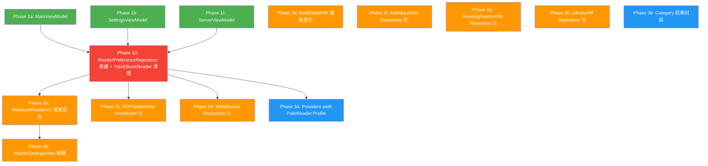

# Views 层 Realm 导入清理计划

> 目标: Views 层 `import RealmSwift` 从 18 → ≤9 个文件

## Latest Status (2026-06-24)

- Phase 3a 已完成：`Providers.swift` 的 FolioReader profile 持久化已收口到独立 repository。
  - 新增 `FolioReaderProfileRepositoryProtocol`
  - 新增 `RealmFolioReaderProfileRepository`
  - 新增 `FolioReaderProfileValue`
  - `FolioReaderDelegatePreferenceProvider` 改为纯运行时 provider，不再持有 `Realm.Configuration` 或直接操作 `FolioReaderPreferenceRealm`
  - `ModelData` 新增 `folioReaderProfileRepository`
  - `FolioReaderPreferenceRealm` 新增 value bridge：`toValue(defaults:)` / `apply(_:)`
- Phase 2 剩余的 4 个观察型/查询型 ViewModel 已完成 Realm 边界清理：
  - `BookDetailViewModel`
  - `ActivityListViewModel`
  - `ReadingPositionViewModel`
  - `LibraryViewModel`
- 新增或扩展的 repository/value-type 边界：
  - `BookRepositoryProtocol.observeBook(id:)`
  - `LibraryRepositoryProtocol.getLibrary(id:)`
  - `LibraryRepositoryProtocol.observeLibrary(id:)`
  - `LibraryRepositoryProtocol.updateLibraryFlags(id:discoverable:autoUpdate:)`
  - `ReadingPositionRepositoryProtocol.debugPositions(forBookId:)`
  - `ReadingPositionRepositoryProtocol.historyBook(for:bookId:)`
  - `ActivityLogRepositoryProtocol`
  - `RealmActivityLogRepository`
- Views 层 `import RealmSwift` 当前剩 3 个文件：
  - `LibraryInfoViewModel.swift`
  - `UnifiedCategoryViewModel.swift`
  - `ReadiumPreferenceAdapter.swift`
- 当前 Phase 3 剩余范围已收敛为：
  - category cache observe 边界（`LibraryInfoViewModel` / `UnifiedCategoryViewModel`）
  - `ReadiumPreferenceAdapter.swift` 持久化映射边界保留
- 验证结果：
  - focused Folio/profile tests: 7 passed
  - focused ViewModel tests: 29 passed
  - full test suite via Xcode MCP `RunAllTests`: 267 passed
> 日期: 2026-06-24

---

## 一、当前状态

### 2026-06-23 Phase 1 实施结果

- 已完成 `MainViewModel` / `SettingsViewModel` / `ServerViewModel` / `YabrEBookReader` 的 Realm 传参与直接偏好读写清理。
- 新增 `ReaderPreferenceRepositoryProtocol` 与 `RealmReaderPreferenceRepository`，由 `ModelData.readerPreferenceRepository` 暴露给 reader entry 层使用。
- `ModelData` 新增 `isDatabaseReady` 与 `refreshDatabase()` facade；`updateServerDSReaderHelper(..., realm:)` 已收口为无 `realm` 版本。
- `MainView.swift` 继续保留 `RealmSwift` 导入并直接注入 `\.realmConfiguration`，这符合 Phase 1 边界。
- Views 层 `import RealmSwift` 已从 18 降到 14；残留主要集中在 Phase 2/3 的观察型 ViewModel、reader runtime 与适配器。

18 个 Views 层文件导入 `RealmSwift`，按角色分类：

### A. ViewModel 层 (9 文件) — 作为 Realm→View 桥接，暂时合理

| 文件 | Realm 用途 | 可否清理 |
|------|-----------|---------|
| `BookDetailViewModel` | 持有 `CalibreBookRealm?`，Realm observe 监听变更 | 🟡 Phase 2 |
| `ActivityListViewModel` | `NotificationToken` 监听 `CalibreActivityLogEntry` | 🟡 Phase 2 |
| `ReadingPositionViewModel` | `realm.objects(BookDeviceReadingPositionRealm.self)` 查询 | 🟡 Phase 2 |
| `LibraryInfoViewModel` | `realm.objects(CalibreLibraryCategoryObject.self)` 观察 | 🟡 Phase 3 |
| `UnifiedCategoryViewModel` | `realm.objects(CalibreLibraryCategoryObject.self)` 观察 | 🟡 Phase 3 |
| `MainViewModel` | `modelData.realmConf` 传递 + `modelData.realm != nil` 检查 | 🟢 Phase 1 |
| `SettingsViewModel` | `modelData.updateServerRealm()` + `realm.refresh()` | 🟢 Phase 1 |
| `ServerViewModel` | `modelData.realm` 传参给 Manager 方法 | 🟢 Phase 1 |
| `LibraryViewModel` | 直接 `Realm(configuration:)` + `CalibreLibraryRealm` observe | 🟡 Phase 2 |

### B. 非 ViewModel 视图/适配器 (9 文件) — 应推入 Repository 层

| 文件 | 行数 | Realm 用途 | 可否清理 |
|------|------|-----------|---------|
| `YabrEBookReader` | 402 | 直接 `Realm()` 查 ReadiumPreference/PDFOptions/FolioReaderPreference | 🟢 Phase 1 |
| `YabrReaderSettingsView` | 458 | 持有 `ReadiumPreferenceRealm`，直接 `prefs.realm?.write` | 🟡 Phase 2 |
| `YabrPDFOptionView` | — | 已改为 `PDFOptionViewModel` + `PDFPreferenceValue` | ✅ Phase 2 |
| `YabrEBookReaderMetaSource` | 294 | 已移除 `Realm()` 直连，改走 `ReaderPreferenceRepository` | ✅ Phase 2 |
| `Providers.swift` | 707 | `Realm()` 查/写 `FolioReaderPreferenceRealm` (偏好 profile) | 🟡 Phase 3 |
| `ReadiumPreferenceAdapter` | 45 | `ReadiumPreferenceRealm` extension (Readium ↔ Realm 转换) | ⚪ 保留 |
| `YabrReadiumReaderVC` | 745 | 持有 `readiumPrefs: ReadiumPreferenceRealm?`，创建/传递 | 🟡 Phase 2 |
| `YabrReadiumEPUBVC` | — | `applyPreferences(_ prefs: ReadiumPreferenceRealm)` 签名 | 🟡 Phase 2 |
| `YabrReadiumPDFVC` | — | `applyPreferences(_ prefs: ReadiumPreferenceRealm)` 签名 | 🟡 Phase 2 |

---

## 二、根因分析

### 1. 阅读器偏好系统尚未 Repository 化

三个阅读引擎各有独立的 Realm 偏好模型，目前由 View/VC 层直接操作：

| 引擎 | Realm 模型 | 操作位置 |
|------|-----------|---------|
| Readium | `ReadiumPreferenceRealm` | `YabrEBookReader`, `YabrReaderSettingsView`, `YabrReadiumReaderVC` |
| PDF | `PDFOptions` | `YabrEBookReader` 统一入口；runtime/UI 已切到 `PDFPreferenceValue` |
| FolioReader | `FolioReaderPreferenceRealm` | `YabrEBookReader`, `Providers.swift` |

**核心问题**: 阅读器偏好没有 Repository 层。所有偏好的读写都直接在 View/VC 层操作 Realm。

### 2. ViewModel 仍直接传递 Realm 实例

`MainViewModel`, `SettingsViewModel`, `ServerViewModel` 将 `modelData.realm` 作为参数传给 Manager 方法，而不是让 Manager 自己获取 Realm 实例。

### 3. ViewModel 直接查询 Realm 对象

`BookDetailViewModel` 持有 `CalibreBookRealm?` 并直接 observe 它；`ActivityListViewModel` 和 `ReadingPositionViewModel` 直接执行 `realm.objects()` 查询；`LibraryViewModel` 直接操作 `CalibreLibraryRealm`。

---

## 三、分阶段实施计划

### Phase 1: 消除 ViewModel 的 Realm 传参模式 (✅ 已完成)

**目标**: 清理 3 个 ViewModel + 1 个路由视图的 Realm 导入

#### 1a. MainViewModel — 移除 `realmConf` 透传

**当前**:
```swift
import RealmSwift
// L61: var realmConf: Realm.Configuration? { modelData.realmConf }
// L66: activeTab < 1 && modelData.realm != nil && modelData.booksInShelf.isEmpty
```

**改造**: 
- `realmConf` 属性仅被 `YabrEBookReader` 消费 → Phase 1c 一起处理
- `modelData.realm != nil` 改为 `modelData.isDatabaseReady: Bool` 布尔属性
- 移除 `import RealmSwift`

#### 1b. SettingsViewModel — Manager 方法内化 Realm

**当前**:
```swift
import RealmSwift
// L85: try? modelData.updateServerRealm(server: updatedServer)
// L124: self.modelData.realm.refresh()
```

**改造**:
- `modelData.updateServerRealm(server:)` 改为不接受 Realm 参数，内部通过 `ServerRepository` 操作
- `realm.refresh()` 改为 `modelData.refreshDatabase()` 封装
- 移除 `import RealmSwift`

#### 1c. ServerViewModel — Manager 方法内化 Realm

**当前**:
```swift
import RealmSwift
// L219: realm: modelData.realm)
// L436: modelData.updateServerDSReaderHelper(..., realm: modelData.realm)
```

**改造**:
- `modelData.updateServerDSReaderHelper(serverId:dsreaderHelper:realm:)` 改为 `updateServerDSReaderHelper(serverId:dsreaderHelper:)`, 内部获取 Realm
- 其他传 `realm` 的 Manager 方法同样改为内部获取
- 移除 `import RealmSwift`

#### 1d. YabrEBookReader — 引入 ReaderPreferenceRepository

**当前** (402 行, 最复杂的非 ViewModel 文件):
```swift
import RealmSwift
// L113-115: Realm() -> realm.object(ofType: ReadiumPreferenceRealm.self, ...)
// L190-191: Realm() -> realm.objects(PDFOptions.self).filter(...)
// L256-258: Realm() -> realm.object(ofType: FolioReaderPreferenceRealm.self, ...)
// L348-393: realm.write { ... } 保存三种引擎偏好
```

**改造**:
- 新建 `ReaderPreferenceRepository` 协议 + `RealmReaderPreferenceRepository` 实现
- 该 Repository 封装所有 ReadiumPreference / PDFOptions / FolioReaderPreference 的 CRUD
- `YabrEBookReader.Coordinator` 通过 Repository 读写偏好
- 移除 `import RealmSwift`

```swift
// Models/Repositories/ReaderPreferenceRepository.swift (新建)
protocol ReaderPreferenceRepositoryProtocol {
    // Readium
    func getReadiumPreference(bookId: String) -> ReadiumPreferenceRealm?
    func saveReadiumPreference(_ prefs: ReadiumPreferenceRealm, bookId: String)
    
    // PDF
    func getPDFOptions(bookId: String, libraryName: String) -> PDFOptions?
    func savePDFOptions(_ opts: PDFOptions)
    
    // FolioReader
    func getFolioReaderPreference(bookId: String) -> FolioReaderPreferenceRealm?
    func saveFolioReaderPreference(_ prefs: FolioReaderPreferenceRealm, bookId: String)
}
```

> [!IMPORTANT]
> Phase 1d 的 `ReaderPreferenceRepository` 是后续 Phase 2 的基石。它一旦存在，
> `YabrReaderSettingsView`、`YabrReadiumReaderVC`、`YabrPDFOptionView` 等文件
> 都可以通过它消除直接 Realm 操作。

**Phase 1 实际结果**:
- 已清理 4 个文件：`MainViewModel.swift`、`SettingsViewModel.swift`、`ServerViewModel.swift`、`YabrEBookReader.swift`
- 新增 `ReaderPreferenceRepositoryTests`
- focused 验证：`MainViewModelTests`、`SettingsViewModelTests`、`CalibreServerManagerTests`、`ReaderPreferenceRepositoryTests` 全通过
- full 验证：`xcodebuild test -project YetAnotherEBookReader.xcodeproj -scheme YetAnotherEBookReader -sdk iphonesimulator -destination 'platform=iOS Simulator,name=iPhone 17'` 通过（235 unit tests + 1 UI test）

---

### Phase 2: 阅读器引擎 VC/View Realm 解耦 (~2 天)

**目标**: 利用 Phase 1d 的 Repository 清理阅读器相关文件

#### 2a. YabrReadiumReaderViewController — 偏好值类型化

**当前**:
```swift
var readiumPrefs: ReadiumPreferenceRealm?  // 持有 Realm managed object
func applyPreferences(_ prefs: ReadiumPreferenceRealm)  // Realm 类型签名
```

**改造**:
- 引入 `ReadiumPreferenceValue` 值类型 (struct)，从 `ReadiumPreferenceRealm` 映射
- `readiumPrefs` 改为 `ReadiumPreferenceValue?`
- `applyPreferences` 签名改为接受值类型
- 偏好保存通过 `ReaderPreferenceRepository` 写回
- 级联更新 `YabrReadiumEPUBVC` 和 `YabrReadiumPDFVC` 的 override 签名

**2026-06-23 实施结果**:
- 已新增 `ReadiumPreferenceValue`，并将 `themeColor`、EPUB/PDF 偏好映射、`ReaderEnginePreferences` 映射、以及 `ReadiumPreferenceRealm` 桥接全部收口到 `ReadiumPreferenceAdapter.swift`
- `ReaderPreferenceRepositoryProtocol` 已扩展 `loadReadiumPreferences(for:)` / `saveReadiumPreferences(_:for:)`
- `YabrReadiumReaderViewController` / EPUB / PDF 子类、`YabrReaderSettingsViewModel`、`YabrReaderSettingsView` 已改为只持有/传递值类型
- `YabrReadiumEnvironment` 现直接注入 `readerPreferenceRepository`
- 已补测试：`ReadiumPreferenceValueTests`、`YabrReaderSettingsViewModelTests`、`YabrReadiumReaderViewControllerTests`，并扩展 `ReaderPreferenceRepositoryTests`
- full 验证：`xcodebuild test -project YetAnotherEBookReader.xcodeproj -scheme YetAnotherEBookReader -sdk iphonesimulator -destination 'platform=iOS Simulator,name=iPhone 17' -derivedDataPath /tmp/YabrDerivedData` 通过（248 unit tests + 1 UI test）

#### 2b. YabrReaderSettingsView — 收口完成（✅）

**2026-06-24 状态**:
- `YabrReaderSettingsView` / `YabrReaderSettingsViewModel` 已在 Phase 2a 一并完成值类型化。
- 运行时编辑对象已从 `ReadiumPreferenceRealm` 切换为 `ReadiumPreferenceValue`。
- 持久化通过 `ReaderPreferenceRepositoryProtocol.loadReadiumPreferences/saveReadiumPreferences` 收口。
- 本阶段不再继续改造 Readium Settings 结构，只保留回归验证，防止后续 reader 改动把 Realm object 重新带回 UI。

#### 2c. PDF runtime 偏好值类型化（✅ 2026-06-24 完成）

**实施结果**:
- 新增 `PDFPreferenceValue`，承接 PDF runtime/UI 所需全部字段与 helper：
  - `fillColor`
  - `isDark`
  - `toReaderEnginePreferences()`
  - `apply(_ preferences: ReaderEnginePreferences)`
- `PDFOptions` 保留为持久化模型，仅保留 `toValue()` / `apply(_ value:)` 桥接。
- `ReaderPreferenceRepositoryProtocol` 已扩展：
  - `loadPDFPreferences(for:)`
  - `savePDFPreferences(_:for:)`
- `RealmReaderPreferenceRepository` 的统一入口 `loadInitialPreferences` / `savePreferences` 已复用 `PDFPreferenceValue` 映射，避免双份 PDF 映射逻辑漂移。
- `YabrPDFMetaSource` / `YabrEBookReaderPDFMetaSource` 已切到值类型边界：
  - 删除 `YabrEBookReaderMetaSource.swift` 的 `RealmSwift` 导入
  - 不再持有 `PDFOptions` managed object
  - 通过 repository 读取/保存 `PDFPreferenceValue`
- `YabrPDFViewController` 运行时状态已改为 `@Published var pdfOptions: PDFPreferenceValue`
  - `open()`
  - `handleOptionsChange(pdfOptions:)`
  - `handleScaleChange(_:)`
  - `applyPreferences(_:)`
  全部改为只操作值类型；持久化通过 meta source / repository 收口。
- `YabrPDFOptionView` 已移除 `@ObservedRealmObject` 和 `RealmSwift` 导入，改为：
  - `PDFOptionViewModel`
  - `@ObservedObject var model`
  - 本地值编辑 + 回调提交
- Views 层 Realm 导入进一步减少 2 个文件：
  - `YabrPDFOptionView.swift`
  - `YabrEBookReaderMetaSource.swift`

**验证**:
- focused:
  - `ReaderPreferenceRepositoryTests`
  - `YabrPDFViewControllerTests`
  - `YabrReadiumReaderViewControllerTests`
  共 26 tests 全通过
- full:
  - `xcodebuild test -project YetAnotherEBookReader.xcodeproj -scheme YetAnotherEBookReader -sdk iphonesimulator -destination 'platform=iOS Simulator,name=iPhone 17' -derivedDataPath /tmp/YabrDerivedData`
  - 255 tests + 1 UI test 全通过

#### 2e. BookDetailViewModel — 消除 `CalibreBookRealm` 持有

**当前**:
```swift
var book: CalibreBookRealm?  // 持有 managed Realm object
bookObserverToken = bookRealm.objectWillChange...  // Realm notification
```

**改造**:
- 改为持有 `CalibreBook` 值类型
- 通过 `BookRepository` 查询，Combine/定时刷新替代 Realm notification
- 或引入 `BookRepository.observeBook(id:) -> AnyPublisher` 封装

#### 2f. ActivityListViewModel — Realm 查询推入 Repository

**当前**:
```swift
let results = realm.objects(CalibreActivityLogEntry.self)
notificationToken = results.observe { ... }
```

**改造**:
- 新增 `ActivityLogRepository` (或扩展现有 Repository) 封装查询
- ViewModel 通过 Publisher 获取日志条目
- 移除 `import RealmSwift`

#### 2g. ReadingPositionViewModel — 查询推入 Repository

**当前**:
```swift
let objs = realm.objects(BookDeviceReadingPositionRealm.self)
modelData.queryBookRealm(book:, realm:)
```

**改造**:
- 通过 `ReadingPositionRepository.getPositions(forBookId:)` 查询
- `queryBookRealm` 替换为 `BookRepository.getBook(id:)`
- 移除 `import RealmSwift`

#### 2h. LibraryViewModel — Realm 观察推入 Repository

**当前**:
```swift
let realmLib = realm.object(ofType: CalibreLibraryRealm.self, ...)
libraryRealmToken = realmLib.observe { ... }
updateRealmField { $0.discoverable = newValue }
```

**改造**:
- 通过 `LibraryRepository` 读写
- Realm observe 替换为 `LibraryRepository.observeLibrary(id:) -> AnyPublisher` 或刷新回调
- 移除 `import RealmSwift`

**Phase 2 预期**: 清理 ~9 个文件，14 → ~5

---

### Phase 3: FolioReader 偏好 + Category 观察 (~1 天)

#### 3a. Providers.swift — FolioReader 偏好 Profile Repository 化

**当前** (707 行中 ~200 行是偏好 profile 管理):
```swift
func openProfileRealm() -> Realm?
realm.object(ofType: FolioReaderPreferenceRealm.self, forPrimaryKey: name)
realm.write { realm.add(profile) }
```

**改造**:
- `FolioReaderDelegatePreferenceProvider` 通过 `ReaderPreferenceRepository` 的 FolioReader 方法操作
- `openProfileRealm()` 和所有 `FolioReaderPreferenceRealm` 直接操作推入 Repository
- 移除 `import RealmSwift`

#### 3b. LibraryInfoViewModel + UnifiedCategoryViewModel — Category 观察封装

**当前**:
```swift
databaseObserver = modelData.realm.objects(CalibreLibraryCategoryObject.self)...
```

**改造**:
- 扩展 `CategoryCacheRepository` 协议添加 observe 方法
- 或通过 `UnifiedCategoryService` 提供变更通知
- ViewModel 改为订阅 Repository/Service Publisher

**Phase 3 预期**: 清理 ~3 个文件，5 → ~2

---

### 保留不清理的文件 (2 个)

| 文件 | 理由 |
|------|------|
| `ReadiumPreferenceAdapter.swift` | 纯 Realm ↔ Readium 类型映射 extension，是持久化边界的一部分 |
| `YabrReadiumReaderVC` (如果仍需) | 底层引擎 VC 可能保留最小 Realm 引用 |

---

## 四、关键新增组件

### ReaderPreferenceRepository (Phase 1d 新建)

```
Models/Repositories/ReaderPreferenceRepository.swift

protocol ReaderPreferenceRepositoryProtocol {
    // Readium EPUB/PDF
    func getReadiumPreference(bookId: String) -> ReadiumPreferenceValue?
    func saveReadiumPreference(_ value: ReadiumPreferenceValue, bookId: String)
    
    // YabrPDF
    func getPDFOptions(bookId: String, libraryName: String) -> PDFOptionsValue?
    func savePDFOptions(_ value: PDFOptionsValue, bookId: String, libraryName: String)
    
    // FolioReader
    func getFolioProfile(name: String) -> FolioReaderPreferenceValue?
    func saveFolioProfile(_ value: FolioReaderPreferenceValue, name: String)
    func listFolioProfiles() -> [String]
    func deleteFolioProfile(name: String)
    func seedDefaultFolioProfile()
}
```

### 值类型补充

```
Models/ReaderPreferenceModels.swift (新建)

struct ReadiumPreferenceValue { ... }    // 从 ReadiumPreferenceRealm 映射
struct PDFOptionsValue { ... }           // 从 PDFOptions 映射
struct FolioReaderPreferenceValue { ... } // 从 FolioReaderPreferenceRealm 映射
```

### ActivityLogRepository (Phase 2f 新建)

```
Models/Repositories/ActivityLogRepository.swift

protocol ActivityLogRepositoryProtocol {
    func getEntries(limit: Int?, bookId: String?) -> [ActivityLogUIEntry]
    func observeEntries() -> AnyPublisher<[ActivityLogUIEntry], Never>
}
```

---

## 五、实施顺序与依赖



---

## 六、预期成果

| 指标 | 当前 | Phase 1 后 | Phase 2 后 | Phase 3 后 |
|------|------|-----------|-----------|-----------|
| Views 层 `import RealmSwift` | 18 | 14 | ~5 | ~2 |
| 非 ViewModel 视图文件 Realm 导入 | 9 | 5 | ~1 | ~1 |
| 新增 Repository | 0 | +1 (ReaderPreference) | +1 (ActivityLog) | — |
| 新增值类型 | 0 | +3 (偏好值类型) | — | — |

---

## 七、验证标准

每个 Phase 完成后:

```bash
# 编译验证
xcodebuild -project YetAnotherEBookReader.xcodeproj \
  -scheme YetAnotherEBookReader -sdk iphonesimulator \
  -destination 'platform=iOS Simulator,name=iPhone 17' build

# 测试验证
xcodebuild test -project YetAnotherEBookReader.xcodeproj \
  -scheme YetAnotherEBookReader -sdk iphonesimulator \
  -destination 'platform=iOS Simulator,name=iPhone 17' \
  -derivedDataPath /tmp/YabrDerivedData

# Realm 导入计数验证
grep -rl "import RealmSwift" YetAnotherEBookReader/Views/ | wc -l
```

- 所有现有 191 tests 0 failures
- 阅读器功能手动冒烟: Readium EPUB 打开/偏好保存, PDF 打开/选项, FolioReader 打开/profile
- 无新增 `force unwrap` 或 `try!`

---

## 八、风险与注意事项

1. **`@ObservedRealmObject` 替换**: `YabrPDFOptionView` 使用了 Realm 的 SwiftUI property wrapper，替换为标准 `@ObservedObject` 需要手动管理数据同步和持久化
2. **Realm Notification 替换**: `BookDetailViewModel` 和 `LibraryViewModel` 依赖 Realm 的实时 object observation 来驱动 UI 更新。替换为 Combine Publisher 需要确保延迟和一致性
3. **`ReadiumPreferenceRealm` 跨层使用**: 该类型被 `ReadiumPreferenceAdapter` (Realm↔Readium 转换)、Settings View (读写)、Reader VC (持有) 三处使用，值类型化需要同步更新所有消费者
4. **FolioReader Profile 系统**: `Providers.swift` 中的偏好 profile CRUD 逻辑较为复杂 (支持多 profile 切换)，Repository 化时需保留完整的 profile 管理语义
