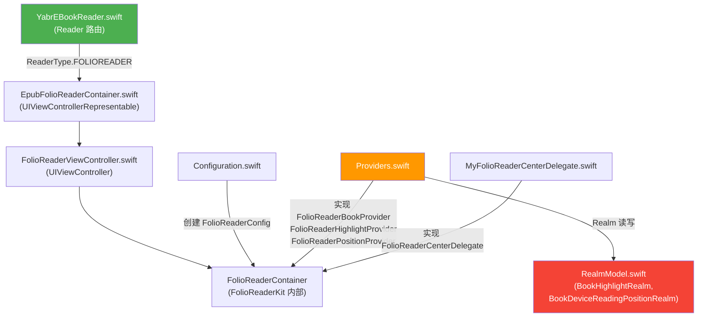
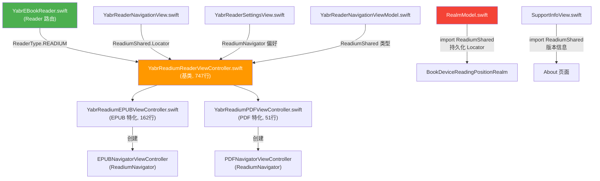
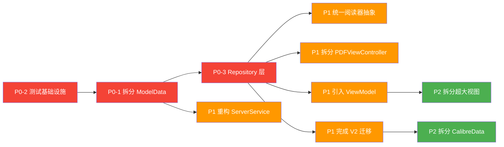

# REFACTOR_PLAN.md — YetAnotherEBookReader (D.S.Reader)

> 基于对全部 88 个 Swift 源文件的完整分析，生成于 2026-06-05

---

## 一、项目现状速览

### 核心目录结构（仅列有业务逻辑的路径）

```
YetAnotherEBookReader/
├── YetAnotherEBookReaderApp.swift          # App 入口 (87行)
├── MainView.swift                          # 主 TabView (419行)
├── Models/
│   ├── ModelData.swift                     # 🔴 核心状态管理 God Object (2180行)
│   ├── CalibreBrowser/
│   │   ├── CalibreBrowser.swift            # 🔴 搜索/浏览/缓存 God Class (2136行)
│   │   ├── CalibreSearchCache.swift        # 搜索缓存 (187行)
│   │   └── V2/
│   │       ├── LibrarySearchServiceV2.swift # V2 搜索服务 (156行)
│   │       ├── LibraryInfoViewModelV2.swift # V2 ViewModel (42行)
│   │       └── LibraryInfoViewV2.swift      # V2 视图 (50行)
│   ├── CalibreData.swift                   # 数据模型定义 (1542行)
│   ├── RealmModel.swift                    # Realm 持久化模型 (1388行)
│   ├── Book.swift                          # 图书模型 + 大量废弃代码 (378行)
│   ├── BookAnnotation.swift                # 标注模型 (362行)
│   ├── BookFiles.swift                     # 文件管理 (151行)
│   ├── BookPreference.swift                # 阅读偏好 (120行)
│   ├── ReadingSessionManager.swift         # 阅读会话 (187行)
│   ├── FontsManager.swift                  # 字体管理 (113行)
│   ├── DatabaseService.swift               # Realm 服务 (16行)
│   ├── Constants.swift                     # 常量 (25行)
│   └── ...其他小文件
├── Network/
│   ├── CalibreServerService.swift          # 🔴 API 服务 God Class (1388行)
│   ├── BookDownloadManager.swift           # 下载管理 (316行)
│   ├── DSReaderHelperConnector.swift        # Helper 插件连接 (222行)
│   ├── Downloader.swift                    # 简易下载器 (89行)
│   ├── ImageRequest.swift                  # Kingfisher 适配 (84行)
│   └── CalibreActivityLogger.swift         # 活动日志 (113行)
├── Views/
│   ├── Reader/
│   │   ├── YabrEBookReader.swift           # 阅读器路由入口 (204行)
│   │   ├── YabrEBookReaderMetaSource.swift # 元数据源 (294行)
│   │   ├── YabrReaderSettingsView.swift    # 阅读设置 (458行)
│   │   └── ...
│   ├── FolioReaderView/
│   │   ├── Providers.swift                 # 🔴 FolioReader 数据提供者 (857行, 含370行废弃代码)
│   │   ├── EpubFolioReaderContainer.swift  # FolioReader 容器 (187行)
│   │   ├── Configuration.swift             # FolioReader 配置 (65行)
│   │   └── MyFolioReaderCenterDelegate.swift # 委托 (57行)
│   ├── ReadiumView/
│   │   ├── YabrReadiumReaderViewController.swift  # Readium 控制器 (747行)
│   │   ├── YabrReadiumEPUBViewController.swift    # EPUB 特化 (162行)
│   │   └── YabrReadiumPDFViewController.swift     # PDF 特化 (51行)
│   ├── PDFView/
│   │   ├── YabrPDFViewController.swift     # 🔴 PDF 阅读器 God VC (1716行)
│   │   ├── YabrPDFView.swift               # PDF SwiftUI 包装 (548行)
│   │   └── ListViews/ (13个文件)            # PDF 侧边栏 UIKit 视图
│   ├── BookDetailView/
│   │   ├── BookDetailView.swift            # 图书详情 (802行)
│   │   └── ...6个辅助文件
│   ├── LibraryInfoView/
│   │   ├── LibraryInfoBookListView.swift   # 图书列表 (714行)
│   │   └── ...7个辅助文件
│   ├── ShelfView/
│   │   ├── SectionShelfController.swift    # UIKit 书架 (612行)
│   │   ├── RecentShelfController.swift     # UIKit 最近 (479行)
│   │   ├── ShelfDataManager.swift          # ✅ 已移动到 Models/ (P2/A10)
│   │   └── ...UI 包装文件
│   ├── SettingsView/
│   │   ├── SettingsView.swift              # 设置主页 (350行)
│   │   ├── ServerView/
│   │   │   ├── AddModServerView.swift      # 服务器配置 (542行)
│   │   │   └── ServerOptionsDSReaderHelper.swift # Helper 配置 (417行)
│   │   └── ...其他设置文件
│   ├── DictView/ (7个文件)                  # 词典功能
│   └── ...其他视图
├── ViewController/
│   ├── FolioReaderViewController.swift     # UIKit 遗留 (89行)
│   ├── MyReaderViewController.swift        # UIKit 遗留 (22行)
│   └── ...
└── Libs/ (3个本地库)                        # HAControls, SMSegmentView, ZFDragableModalTransition
```

### 技术债总量估算

| 指标 | 数值 |
|------|------|
| **总 Swift 代码行数** | **28,702 行** |
| **Swift 源文件数** | **88 个** |
| **超过 300 行的文件** | **15 个** (占总行数 60%+) |
| **超过 1000 行的文件** | **5 个** (占总行数 32%) |
| **已标记废弃的代码项** | **11 处** (~600 行) |
| **导入 RealmSwift 的文件** | **36 个** (含视图层 20+ 个) |
| **导入 FolioReaderKit 的文件** | **7 个** |
| **导入 Readium 模块的文件** | **10 个** |
| **DispatchQueue 使用点** | **50+ 处** |
| **@Published 属性总数** | **60+ 个** (仅 ModelData 就有 18 个) |
| **测试覆盖率** | **~0%** (仅 1 个占位测试) |

**问题类型分布**：

| 问题类型 | 数量 | 占比 |
|---------|------|------|
| God Object / 超大文件 | 5 | 18% |
| 层级违反 (Realm 泄漏到视图层) | 20+ | 36% |
| 重复代码 (三引擎三套实现) | 3 组 | 11% |
| 废弃代码未清理 | 11 处 | 14% |
| 线程安全问题 | 5 处 | 7% |
| 数据流混乱 | 3 处 | 7% |
| 缺失测试 | 全局 | 7% |

---

## 二、架构问题清单

### [A01] ModelData God Object — 2180 行的上帝类

- **位置**：[ModelData.swift](file:///Users/peterlee/git/YetAnotherEBookReader/YetAnotherEBookReader/Models/ModelData.swift) (L1-2180)
- **现象**：单个 `ObservableObject` 承担了服务器管理、图书馆管理、图书管理、下载管理、阅读位置管理、Web 服务器管理、数据库初始化、书架管理、字体管理、会话管理等全部职责。包含 18 个 `@Published` 属性、6 个 Combine Subject、多个静态 DispatchQueue。
- **影响**：任何一个 `@Published` 属性变化会触发所有观察此对象的 SwiftUI 视图重新计算。新功能开发必须修改此文件，极高的合并冲突风险。无法单独测试任何功能模块。
- **严重程度**：🔴 高

---

### [A02] CalibreBrowser.swift (CalibreLibrarySearchManager) — 2137 行的搜索/浏览/缓存巨类

- **位置**：[CalibreBrowser.swift](file:///Users/peterlee/git/YetAnotherEBookReader/YetAnotherEBookReader/Models/CalibreBrowser/CalibreBrowser.swift) (L1-2137)
- **现象**：文件中包含 `CalibreLibrarySearchManager` 类 (L161-2137) 及多个辅助 struct/enum (L13-160)。该类集搜索、缓存管理、分类浏览、统一搜索合并于一身。持有 `private let modelData: ModelData` (L169) 直接引用和两个私有 DispatchQueue (L182-183) 进行 Realm 缓存操作。使用 `force unwrap` 的 `cacheRealm: Realm!` (L180)。
- **影响**：单文件承担过多职责，2137 行难以维护。Realm 缓存操作分散在多个 DispatchQueue 间，线程安全依赖人工保证。`try! cacheRealm.write` 散布在整个类中（如 L265, L273, L281, L396, L410, L432 等），任何 Realm 异常都会 crash。
- **严重程度**：🔴 高

---

### [A03] YabrPDFViewController — 1716 行的超大 ViewController

- **位置**：[YabrPDFViewController.swift](file:///Users/peterlee/git/YetAnotherEBookReader/YetAnotherEBookReader/Views/PDFView/YabrPDFViewController.swift) (L1-1716)
- **现象**：一个 UIViewController 包含了 PDF 渲染、标注绘制(L502-650)、书签管理(L802-900)、搜索(L1052-1200)、分享导出(L1202-1350)、阅读位置追踪(L1352-1500)、主题管理(L1502-1650)、导航栏(L202-350)、手势处理(L652-800) 等全部功能。拥有约 40 个属性。
- **影响**：无法单独测试任何子功能。添加新 PDF 功能需要在 1700+ 行中找到正确位置。包含多处 `DispatchQueue.global`→`DispatchQueue.main` 的线程跳转 (L598, L625, L813, L829)。
- **严重程度**：🔴 高

---

### [A04] CalibreServerService — 1388 行的网络 God Service

- **位置**：[CalibreServerService.swift](file:///Users/peterlee/git/YetAnotherEBookReader/YetAnotherEBookReader/Network/CalibreServerService.swift) (L1-1388)
- **现象**：所有 Calibre API 调用集中在单个类中（~15 个 API 端点方法）。通过 `weak var modelData: ModelData?` (L12-15) 直接引用 ModelData。错误处理不统一：混合使用 `Result<T,Error>`、可选 completion handler、Combine publisher。全部使用 URLSession completion handler（无 async/await）。
- **影响**：无法单独测试网络请求。错误处理不一致导致 UI 层无法统一展示错误。主线程回调分散在各方法中 (L346, L569)。
- **严重程度**：🔴 高

---

### [A05] RealmSwift 泄漏到视图层 — 36 个文件导入 RealmSwift

- **位置**：全局，以下视图文件不应导入 RealmSwift：
  - [MainView.swift:L11](file:///Users/peterlee/git/YetAnotherEBookReader/YetAnotherEBookReader/MainView.swift#L11)
  - [BookDetailView.swift:L11](file:///Users/peterlee/git/YetAnotherEBookReader/YetAnotherEBookReader/Views/BookDetailView/BookDetailView.swift#L11)
  - [LibraryInfoBookListView.swift:L9](file:///Users/peterlee/git/YetAnotherEBookReader/YetAnotherEBookReader/Views/LibraryInfoView/LibraryInfoBookListView.swift#L9)
  - [SectionShelfController.swift:L12](file:///Users/peterlee/git/YetAnotherEBookReader/YetAnotherEBookReader/Views/ShelfView/SectionShelfController.swift#L12)
  - [ShelfDataManager.swift:L11](file:///Users/peterlee/git/YetAnotherEBookReader/YetAnotherEBookReader/Models/ShelfDataManager.swift#L11)
  - [Providers.swift:L10](file:///Users/peterlee/git/YetAnotherEBookReader/YetAnotherEBookReader/Views/FolioReaderView/Providers.swift#L10)
  - [BookDownloadManager.swift:L11](file:///Users/peterlee/git/YetAnotherEBookReader/YetAnotherEBookReader/Network/BookDownloadManager.swift#L11)
  - ...及另外 13+ 个视图文件
- **现象**：视图层直接使用 Realm `Results`、`Object` 类型，进行 Realm 查询和写入。
- **影响**：无法替换持久化方案（如迁移到 SwiftData）。视图直接依赖数据库，违反分层架构。Realm 的线程限制（对象不能跨线程）在视图层更容易被违反。
- **严重程度**：🔴 高

---

### [A06] 阅读位置保存/恢复 — 三引擎三套实现

- **位置**：
  - FolioReader 路径：[Providers.swift:L702-857](file:///Users/peterlee/git/YetAnotherEBookReader/YetAnotherEBookReader/Views/FolioReaderView/Providers.swift#L702-L857) + [MyFolioReaderCenterDelegate.swift](file:///Users/peterlee/git/YetAnotherEBookReader/YetAnotherEBookReader/Views/FolioReaderView/MyFolioReaderCenterDelegate.swift)
  - Readium 路径：[YabrReadiumReaderViewController.swift:L352-430](file:///Users/peterlee/git/YetAnotherEBookReader/YetAnotherEBookReader/Views/ReadiumView/YabrReadiumReaderViewController.swift#L352-L430)
  - PDF 路径：[YabrPDFViewController.swift:L1352-1500](file:///Users/peterlee/git/YetAnotherEBookReader/YetAnotherEBookReader/Views/PDFView/YabrPDFViewController.swift#L1352-L1500)
- **现象**：每个阅读引擎有独立的位置保存/恢复逻辑，各自转换为 `BookDeviceReadingPosition` 并写入 Realm，但转换代码各不相同。
- **影响**：修复位置同步 bug 需要在三处同步修改。新增阅读引擎需要重新实现整套逻辑。不同引擎间的位置数据格式可能不一致。
- **严重程度**：🔴 高

---

### [A07] Providers.swift 中 ~370 行废弃代码仍然存在

- **位置**：[Providers.swift:L330-700](file:///Users/peterlee/git/YetAnotherEBookReader/YetAnotherEBookReader/Views/FolioReaderView/Providers.swift#L330-L700)
- **现象**：
  - L330: `@available(*, deprecated, message: "replaced by BookHighlightRealm")` — 旧的高亮处理类，约 170 行
  - L501: `@available(*, deprecated, message: "replaced by BookDeviceReadingPositionRealm")` — 旧的位置处理类，约 200 行
- **影响**：增加维护负担和代码阅读成本。编译时间浪费。
- **严重程度**：🟡 中

---

### [A08] 视图层直接访问 ModelData — 无 ViewModel 分隔

- **位置**：几乎所有视图文件，典型例子：
  - [BookDetailView.swift:L22-80](file:///Users/peterlee/git/YetAnotherEBookReader/YetAnotherEBookReader/Views/BookDetailView/BookDetailView.swift#L22-L80) — 直接读写 modelData 属性
  - [LibraryInfoBookListView.swift:L352-550](file:///Users/peterlee/git/YetAnotherEBookReader/YetAnotherEBookReader/Views/LibraryInfoView/LibraryInfoBookListView.swift#L352-L550) — 搜索防抖、分页逻辑内联在视图中
  - [MainView.swift:L82-250](file:///Users/peterlee/git/YetAnotherEBookReader/YetAnotherEBookReader/MainView.swift#L82-L250) — 直接读写 modelData.activeTab
- **现象**：视图通过 `@EnvironmentObject var modelData: ModelData` 直接访问 2180 行的 God Object，绕过任何 ViewModel 层。搜索防抖、分页、过滤等逻辑内联在 View body 中。
- **影响**：ModelData 任何属性变化触发全体视图重绘。视图逻辑不可测试。无法区分读/写访问权限。
- **严重程度**：🔴 高

---

### [A09] DSReaderHelperConnector 中的 DispatchQueue.main.sync — 脆弱的线程安全

- **位置**：[DSReaderHelperConnector.swift:L29-35](file:///Users/peterlee/git/YetAnotherEBookReader/YetAnotherEBookReader/Network/DSReaderHelperConnector.swift#L29-L35)
- **现象**：`urlSession` 计算属性中使用 `Thread.isMainThread` 检查后决定是否 `DispatchQueue.main.sync`：
  ```swift
  if Thread.isMainThread == false {
      DispatchQueue.main.sync {
          URLCredentialStorage.shared.set(userCredential, for: space)
      }
  } else {
      URLCredentialStorage.shared.set(userCredential, for: space)
  }
  ```
  虽有主线程检查避免直接死锁，但 `DispatchQueue.main.sync` 在非主线程调用时仍会阻塞当前线程等待主线程完成，如果主线程此时等待当前线程持有的锁，仍可能间接死锁。
- **影响**：潜在的间接死锁风险。此外，每次访问 `urlSession` 属性都重新设置 credential，效率低下。
- **严重程度**：🟡 中

---

### [A10] ShelfDataManager 错放在 Views 目录 ✅ 已完成 (P2/A10, 2026-06-18)

- **位置**：~~[ShelfDataManager.swift](file:///Users/peterlee/git/YetAnotherEBookReader/YetAnotherEBookReader/Views/ShelfView/ShelfDataManager.swift)~~ → [Models/ShelfDataManager.swift](file:///Users/peterlee/git/YetAnotherEBookReader/YetAnotherEBookReader/Models/ShelfDataManager.swift)
- **现象**：数据管理类放在 `Views/ShelfView/` 目录下，包含大量 Realm 操作和 Combine 管道。
- **影响**：违反目录组织约定。其他需要书架数据的模块找不到这个类。暗示整个项目的分层边界不清晰。
- **严重程度**：🟡 中
- **状态**：✅ 已通过 `xcode_XcodeMV` 移动到 `Models/`，保留 app 和 Catalyst 双 target 成员资格，无声明改动。`xcodebuild build` + 全量 `xcodebuild test` 通过（87 unit + 1 UI）。

---

### [A11] CalibreData.swift — 1542 行的数据模型巨文件

- **位置**：[CalibreData.swift](file:///Users/peterlee/git/YetAnotherEBookReader/YetAnotherEBookReader/Models/CalibreData.swift) (L1-1542)
- **现象**：16+ 个 struct/enum 定义集中在单个文件中，包括 `CalibreServer`、`CalibreLibrary`、`CalibreBook`、`Format`、`ReaderType`、`BookDeviceReadingPosition` 等。`CalibreBook` 在 L1352-1542 有大量计算属性，部分属于视图层关注点。
- **影响**：文件过长难以导航。不同领域的模型混在一起增加理解成本。
- **严重程度**：🟡 中

---

### [A12] RealmModel.swift — 1388 行的 Realm 模型巨文件

- **位置**：[RealmModel.swift](file:///Users/peterlee/git/YetAnotherEBookReader/YetAnotherEBookReader/Models/RealmModel.swift) (L1-1388)
- **现象**：12+ 个 Realm Object 子类全部定义在单个文件中。包含废弃的 `CalibreBookLastReadPositionRealm` (L582, `@available(*, deprecated)`)。复杂的线性迁移逻辑 (L1002-1300)。导入了 `ReadiumShared` 和 `ReadiumNavigator` — 持久化层依赖阅读框架。
- **影响**：Realm 模型与 Readium 类型耦合，意味着升级 Readium 可能需要 Realm 迁移。迁移逻辑难以测试。
- **严重程度**：🟡 中

---

### [A13] Book.swift 中约 200 行废弃代码

- **位置**：[Book.swift](file:///Users/peterlee/git/YetAnotherEBookReader/YetAnotherEBookReader/Models/Book.swift)
  - [L13](file:///Users/peterlee/git/YetAnotherEBookReader/YetAnotherEBookReader/Models/Book.swift#L13): `@available(*, deprecated)` `InShelfBook`
  - [L20](file:///Users/peterlee/git/YetAnotherEBookReader/YetAnotherEBookReader/Models/Book.swift#L20): `@available(*, deprecated)` `CalibreBookMetadata`
  - [L223](file:///Users/peterlee/git/YetAnotherEBookReader/YetAnotherEBookReader/Models/Book.swift#L223): `@available(*, deprecated)` `CalibreBookEntry`
  - [L257](file:///Users/peterlee/git/YetAnotherEBookReader/YetAnotherEBookReader/Models/Book.swift#L257): `@available(*, deprecated)` `CalibreBookEntryCodable`
- **现象**：378 行中约 200+ 行是标记为废弃的旧数据迁移结构体。
- **影响**：增加编译时间和代码复杂度。新开发者易混淆新旧 API。
- **严重程度**：🟡 中

---

### [A14] 高亮/标注处理 — 三引擎重复实现

- **位置**：
  - FolioReader：[Providers.swift:L702-750](file:///Users/peterlee/git/YetAnotherEBookReader/YetAnotherEBookReader/Views/FolioReaderView/Providers.swift#L702-L750)
  - Readium：[YabrReadiumReaderViewController.swift:L432-500](file:///Users/peterlee/git/YetAnotherEBookReader/YetAnotherEBookReader/Views/ReadiumView/YabrReadiumReaderViewController.swift#L432-L500)
  - PDF：[YabrPDFViewController.swift:L502-650](file:///Users/peterlee/git/YetAnotherEBookReader/YetAnotherEBookReader/Views/PDFView/YabrPDFViewController.swift#L502-L650)
- **现象**：三个阅读引擎各自实现高亮的持久化和恢复逻辑。
- **影响**：同 [A06]，修 bug 需三处同步。
- **严重程度**：🟡 中

---

### [A15] 主题/外观设置 — 三引擎重复实现

- **位置**：
  - FolioReader：[Configuration.swift:L10-65](file:///Users/peterlee/git/YetAnotherEBookReader/YetAnotherEBookReader/Views/FolioReaderView/Configuration.swift#L10-L65)
  - Readium：[YabrReadiumReaderViewController.swift:L582-650](file:///Users/peterlee/git/YetAnotherEBookReader/YetAnotherEBookReader/Views/ReadiumView/YabrReadiumReaderViewController.swift#L582-L650)
  - PDF：[YabrPDFViewController.swift:L1502-1650](file:///Users/peterlee/git/YetAnotherEBookReader/YetAnotherEBookReader/Views/PDFView/YabrPDFViewController.swift#L1502-L1650)
- **现象**：用户偏好（字体、主题、颜色）到各引擎的转换逻辑各自实现。
- **影响**：新增一个阅读偏好选项需要在三个地方实现。
- **严重程度**：🟡 中

---

### [A16] BookDetailView — 802 行的超大 SwiftUI 视图

- **位置**：[BookDetailView.swift](file:///Users/peterlee/git/YetAnotherEBookReader/YetAnotherEBookReader/Views/BookDetailView/BookDetailView.swift) (L1-802)
- **现象**：body 约 120 行，15+ 个 @State 属性，多个 `.sheet` 修饰符链式调用 (L722-793)。直接导入 RealmSwift (L11)。
- **影响**：SwiftUI 预览加载缓慢。修改任何部分需要理解整个 802 行上下文。
- **严重程度**：🟡 中

---

### [A17] LibraryInfoBookListView — 714 行，业务逻辑内联

- **位置**：[LibraryInfoBookListView.swift](file:///Users/peterlee/git/YetAnotherEBookReader/YetAnotherEBookReader/Views/LibraryInfoView/LibraryInfoBookListView.swift) (L1-714)
- **现象**：搜索防抖逻辑 (L352-450)、分页加载 (L552-650)、过滤工具栏 (L452-550) 全部内联在视图中。
- **影响**：搜索和分页逻辑不可单独测试。视图职责过重。
- **严重程度**：🟡 中

---

### [A18] V1/V2 共存 — 未完成的架构迁移

- **位置**：
  - V1：[CalibreBrowser.swift](file:///Users/peterlee/git/YetAnotherEBookReader/YetAnotherEBookReader/Models/CalibreBrowser/CalibreBrowser.swift) (2136行)
  - V2：[LibrarySearchServiceV2.swift](file:///Users/peterlee/git/YetAnotherEBookReader/YetAnotherEBookReader/Models/CalibreBrowser/V2/LibrarySearchServiceV2.swift) (156行)
- **现象**：V2 仅迁移了搜索功能 (156行 vs V1 2136行)，V1 仍处理绝大部分功能。两套系统可能同时运行。
- **影响**：维护两套系统的成本。新功能不确定应添加到 V1 还是 V2。
- **严重程度**：🟡 中

---

### [A19] 网络层无统一错误处理

- **位置**：[CalibreServerService.swift](file:///Users/peterlee/git/YetAnotherEBookReader/YetAnotherEBookReader/Network/CalibreServerService.swift) 全文
- **现象**：混用 `Result<T, Error>`、可选 completion handler、Combine publisher、静默失败 (guard-else 直接 return)。没有自定义 Error 类型。
- **影响**：UI 层无法统一展示错误信息。网络错误被静默吞掉，用户看不到反馈。调试困难。
- **严重程度**：🟡 中

---

### [A20] CalibreLibrarySearchManager 强引用 ModelData + Realm force unwrap

- **位置**：[CalibreBrowser.swift:L169, L180-181](file:///Users/peterlee/git/YetAnotherEBookReader/YetAnotherEBookReader/Models/CalibreBrowser/CalibreBrowser.swift#L169)
- **现象**：`private let modelData: ModelData` 强引用 ModelData，可能造成循环引用（ModelData 通过 `lazy var librarySearchManager` 持有它）。`private var cacheRealm: Realm!` 和 `var cacheRealmConf: Realm.Configuration!` 使用隐式解包可选值。整个类中大量使用 `try! cacheRealm.write` (20+ 处)，任何一次 Realm 写入异常即会 crash。
- **影响**：潜在循环引用导致内存泄漏。force unwrap 和 `try!` 在边缘场景（磁盘满、迁移失败等）会导致崩溃。
- **严重程度**：🟡 中

---

### [A21] UIKit/SwiftUI 混合书架 — 复杂桥接

- **位置**：
  - [SectionShelfController.swift](file:///Users/peterlee/git/YetAnotherEBookReader/YetAnotherEBookReader/Views/ShelfView/SectionShelfController.swift) (612行) — UICollectionViewController
  - [RecentShelfController.swift](file:///Users/peterlee/git/YetAnotherEBookReader/YetAnotherEBookReader/Views/ShelfView/RecentShelfController.swift) (479行) — UICollectionViewController
  - [SectionShelfUI.swift](file:///Users/peterlee/git/YetAnotherEBookReader/YetAnotherEBookReader/Views/ShelfView/SectionShelfUI.swift) / [RecentShelfUI.swift](file:///Users/peterlee/git/YetAnotherEBookReader/YetAnotherEBookReader/Views/ShelfView/RecentShelfUI.swift) — UIViewControllerRepresentable 包装
- **现象**：UIKit UICollectionViewController 通过 Representable 包装嵌入 SwiftUI，且控制器内部使用 Combine 订阅 ModelData。
- **影响**：双向数据流复杂。UIKit 和 SwiftUI 生命周期交叉导致难以调试的问题。
- **严重程度**：🟡 中

---

### [A22] CalibreSearchCache 中 4 个废弃属性仍在使用

- **位置**：[CalibreSearchCache.swift:L49-59](file:///Users/peterlee/git/YetAnotherEBookReader/YetAnotherEBookReader/Models/CalibreBrowser/CalibreSearchCache.swift#L49-L59)
- **现象**：4 个属性标记为 `@available(*, deprecated, message: "use sources")`，但仍被 CalibreBrowser.swift 引用。
- **影响**：废弃迁移未完成，增加代码理解难度。
- **严重程度**：🟢 低

---

### [A23] DatabaseService — 使用 Force Unwrap 的 Realm 实例

- **位置**：[DatabaseService.swift:L12-13](file:///Users/peterlee/git/YetAnotherEBookReader/YetAnotherEBookReader/Models/DatabaseService.swift#L12-L13)
- **现象**：`@Published var realmConf: Realm.Configuration!` 和 `@Published var realm: Realm!` 使用隐式解包可选值。
- **影响**：在数据库初始化失败时会 crash，而非优雅降级。
- **严重程度**：🟡 中

---

### [A24] Readium 类型泄漏到 RealmModel 持久化层

- **位置**：[RealmModel.swift](file:///Users/peterlee/git/YetAnotherEBookReader/YetAnotherEBookReader/Models/RealmModel.swift) — 顶部导入 `ReadiumShared`, `ReadiumNavigator`
- **现象**：Realm 模型文件依赖 Readium SDK 类型（如 `Locator`）进行阅读位置序列化。
- **影响**：升级 Readium SDK 时可能需要 Realm 数据迁移。持久化层与阅读引擎耦合，无法独立演进。
- **严重程度**：🟡 中

---

### [A25] 测试覆盖几乎为零

- **位置**：[LibrarySearchServiceV2Tests.swift](file:///Users/peterlee/git/YetAnotherEBookReader/YetAnotherEBookReader/../YetAnotherEBookReaderTests/LibrarySearchServiceV2Tests.swift) (仅 11 行，占位测试)
- **现象**：整个项目仅有一个占位测试文件，无实际断言。无 UI 测试，无集成测试，无测试基础设施。
- **影响**：重构无安全网。无法验证回归。无法自动化验收。
- **严重程度**：🔴 高

---

### [A26] Readium ViewController 中的 timing hack

- **位置**：
  - [YabrReadiumReaderViewController.swift:L629](file:///Users/peterlee/git/YetAnotherEBookReader/YetAnotherEBookReader/Views/ReadiumView/YabrReadiumReaderViewController.swift#L629): `DispatchQueue.main.asyncAfter(deadline: .now() + 0.1)`
  - [YabrReadiumReaderViewController.swift:L681](file:///Users/peterlee/git/YetAnotherEBookReader/YetAnotherEBookReader/Views/ReadiumView/YabrReadiumReaderViewController.swift#L681): `DispatchQueue.main.asyncAfter(deadline: .now() + 0.1)`
- **现象**：通过固定延迟的 asyncAfter 来解决竞态条件，而非使用正确的同步机制。
- **影响**：在不同性能的设备上行为不一致。可能导致间歇性 bug。
- **严重程度**：🟢 低

---

### [A27] Realm ↔ 值类型手动转换 — 大量样板代码

- **位置**：散布在 [RealmModel.swift](file:///Users/peterlee/git/YetAnotherEBookReader/YetAnotherEBookReader/Models/RealmModel.swift)、[CalibreBrowser.swift](file:///Users/peterlee/git/YetAnotherEBookReader/YetAnotherEBookReader/Models/CalibreBrowser/CalibreBrowser.swift)、[ModelData.swift](file:///Users/peterlee/git/YetAnotherEBookReader/YetAnotherEBookReader/Models/ModelData.swift) 中
- **现象**：每个 Realm Object 都有对应的 struct 在 CalibreData.swift 中，转换需要约 50 行手写映射代码。转换逻辑分散在多个文件中。
- **影响**：新增字段需要在 3-4 个地方同步修改。转换代码容易遗漏字段。
- **严重程度**：🟡 中

---

## 三、重构优先级矩阵

| 优先级 | 问题编号 | 任务描述 | 影响范围 | 难度 | 预计改动文件数 |
|--------|---------|---------|---------|------|-------------|
| **P0** | A01 | 拆分 ModelData God Object | 全局 (88文件中36个直接引用) | 高 | 40+ |
| **P0** | A25 | 建立测试基础设施 | 全局 | 中 | 10+ |
| **P0** | A05 | 引入 Repository 层隔离 Realm | 全局 (36个文件) | 高 | 36 |
| **P1** | A06+A14+A15 | 统一阅读引擎抽象层 | Reader (19文件) | 高 | 19 |
| **P1** | A03 | 拆分 YabrPDFViewController | PDFView (14文件) | 中 | 8 |
| **P1** | A04 | 重构 CalibreServerService | Network (6文件) | 中 | 6 |
| **P1** | A02 | 拆分/重构 CalibreBrowser + 完成 V2 迁移 | Models (5文件) | 高 | 8 |
| **P1** | A08 | 为主要视图引入 ViewModel | Views (15文件) | 中 | 15 |
| **P1** | A09 | 重构 DSReaderHelper 线程安全 | Network (1文件) | 低 | 1 |
| **P2** | A07+A13+A22 | 清理废弃代码 | 散布 | 低 | 5 |
| **P2** | A11 | 拆分 CalibreData.swift | Models (1文件→多文件) | 低 | 5 |
| **P2** | A12+A24 | 拆分 RealmModel + 解耦 Readium | Models | 中 | 4 |
| **P2** | A10 | 移动 ShelfDataManager 到 Models | Views→Models | 低 | 2 |
| **P2** | A16+A17 | 拆分 BookDetailView + LibraryInfoBookListView | Views | 低 | 4 |
| **P2** | A21 | 书架视图 SwiftUI 原生化 | ShelfView (5文件) | 高 | 7 |
| **P2** | A19 | 统一网络错误处理 | Network | 中 | 6 |

> **P0 定义**：不改会阻塞后续所有重构  
> **P1 定义**：高价值，可独立完成，不依赖其他任务  
> **P2 定义**：有益但可延后

---

## 四、P0 任务详细说明

### P0-1：拆分 ModelData God Object

- **涉及文件**：
  - [ModelData.swift](file:///Users/peterlee/git/YetAnotherEBookReader/YetAnotherEBookReader/Models/ModelData.swift) (主要修改)
  - 36+ 个引用 `modelData` 的视图文件 (更新引用)
  - 新建 5-7 个服务文件

- **当前状态**：
  ```swift
  // ModelData.swift — 2180 行，18 个 @Published 属性
  class ModelData: ObservableObject {
      @Published var calibreServers = [String: CalibreServer]()
      @Published var calibreLibraries = [String: CalibreLibrary]()
      @Published var booksInShelf = [String: CalibreBook]()
      @Published var selectedBookId: String? = nil
      @Published var downloadManager = BookDownloadManager()
      @Published var sessionManager = ReadingSessionManager()
      @Published var updatingMetadata = false
      @Published var fontsManager = FontsManager()
      // ... 10+ 更多 @Published
      // ... 2000+ 行方法
      
      func addServer(...) { ... }
      func syncLibrary(...) { ... }
      func saveBooksMetadata(...) { ... }
      func updateReadingPosition(...) { ... }
      func setupWebServer() { ... }
      // ... 50+ 方法
  }
  ```

- **目标状态**：
  ```swift
  // ModelData.swift — ~200 行，协调各服务
  class ModelData: ObservableObject {
      let serverService: CalibreServerManager  // 服务器管理
      let libraryService: CalibreLibraryManager // 图书馆管理
      let bookService: CalibreBookManager       // 图书管理
      let shelfService: ShelfService            // 书架管理
      let downloadService: DownloadService      // 下载管理
      let webServerService: WebServerService    // 本地服务器
      let databaseService: DatabaseService      // 数据库初始化
      
      @Published var activeTab = 0
      @Published var selectedBookId: String?
  }
  
  // CalibreServerManager.swift — ~300 行
  class CalibreServerManager: ObservableObject {
      @Published var servers = [String: CalibreServer]()
      func addServer(...) { ... }
      func removeServer(...) { ... }
  }
  
  // CalibreBookManager.swift — ~400 行
  class CalibreBookManager: ObservableObject {
      @Published var booksInShelf = [String: CalibreBook]()
      func saveBooksMetadata(...) { ... }
      func getBook(...) { ... }
  }
  // ... 其他服务类类似
  ```

- **执行步骤**：
  1. 在 `Models/` 下创建 `Services/` 子目录
  2. 提取 `CalibreServerManager`：从 ModelData 移出 L350-700 (服务器管理方法) 和 `calibreServers`、`calibreServerInfoStaging` 属性
  3. 提取 `CalibreLibraryManager`：移出 L700-1000 (图书馆管理) 和 `calibreLibraries`、`calibreLibraryInfoStaging`、`librarySyncStatus` 属性
  4. 提取 `CalibreBookManager`：移出 L1000-1500 (图书管理) 和 `booksInShelf`、`booksAnnotation` 属性
  5. 提取 `ReadingPositionService`：移出 L1500-1700
  6. 提取 `WebServerService`：移出 L1850-2000 (GCDWebServer 相关)
  7. 在 ModelData 中保留服务实例引用和跨服务协调逻辑
  8. 更新所有视图文件，将 `modelData.addServer(...)` 改为 `modelData.serverService.addServer(...)` 或注入具体服务
  9. 逐个视图更新，确保每次改动后编译通过

- **验收标准**：
  - `xcodebuild -project YetAnotherEBookReader.xcodeproj -scheme YetAnotherEBookReader -sdk iphonesimulator -destination 'platform=iOS Simulator,name=iPhone 17' build` 编译通过
  - ModelData.swift 行数降至 300 以下
  - 每个新服务类不超过 500 行
  - 所有原有功能保持不变（手动冒烟测试）

- **注意事项**：
  - `@EnvironmentObject var modelData: ModelData` 在视图中仍然可用，但具体操作委托给子服务
  - Combine Subject 的订阅关系需要仔细梳理，确保服务间的事件传递不中断
  - `SaveBooksMetadataRealmQueue` 等静态属性需移至对应的服务类
  - 分步提取，每步确保编译通过后再继续

---

### P0-2：建立测试基础设施

- **涉及文件**：
  - [YetAnotherEBookReaderTests/](file:///Users/peterlee/git/YetAnotherEBookReader/YetAnotherEBookReaderTests/) (扩充)
  - 新建测试辅助文件
  - [ModelData.swift](file:///Users/peterlee/git/YetAnotherEBookReader/YetAnotherEBookReader/Models/ModelData.swift) (提取协议)

- **当前状态**：
  ```swift
  // LibrarySearchServiceV2Tests.swift — 唯一的测试文件
  import XCTest
  class LibrarySearchServiceV2Tests: XCTestCase {
      func testExample() throws {
          // 空的占位测试
      }
  }
  ```

- **目标状态**：
  ```swift
  // TestHelpers/RealmTestHelper.swift
  class RealmTestHelper {
      static func inMemoryRealm() -> Realm {
          let config = Realm.Configuration(inMemoryIdentifier: UUID().uuidString)
          return try! Realm(configuration: config)
      }
  }
  
  // TestHelpers/MockCalibreServerService.swift
  class MockCalibreServerService: CalibreServerServiceProtocol {
      var searchResult: Result<[CalibreBook], Error> = .success([])
      func searchBooks(...) async throws -> [CalibreBook] { ... }
  }
  
  // CalibreServerManagerTests.swift
  class CalibreServerManagerTests: XCTestCase {
      func testAddServer_savesToRealm() { ... }
      func testRemoveServer_cleansUpLibraries() { ... }
  }
  
  // CalibreBookManagerTests.swift
  class CalibreBookManagerTests: XCTestCase {
      func testSaveBooksMetadata_writesToRealm() { ... }
      func testGetBook_returnsCorrectBook() { ... }
  }
  ```

- **执行步骤**：
  1. 为关键服务类定义协议（Protocol），使其可被 Mock
  2. 创建 `TestHelpers/` 目录，实现 `RealmTestHelper`（内存 Realm）
  3. 创建 `MockCalibreServerService` 等 Mock 类
  4. 为 P0-1 提取出的每个服务类编写基础单元测试（CRUD 操作）
  5. 为 `CalibreServerService` 的 API 解析逻辑编写测试（使用本地 JSON fixtures）
  6. 配置 CI 脚本运行测试

- **验收标准**：
  - `xcodebuild test -project YetAnotherEBookReader.xcodeproj -scheme YetAnotherEBookReader -sdk iphonesimulator -destination 'platform=iOS Simulator,name=iPhone 17'` 全部通过
  - 至少覆盖每个新服务类的核心 CRUD 方法
  - Mock 基础设施可复用

- **注意事项**：
  - 优先测试数据层和网络解析，UI 测试可后续补充
  - Realm 测试必须使用 inMemory 配置，避免测试间干扰
  - 此任务应与 P0-1 并行或紧随其后

---

### P0-3：引入 Repository 层隔离 Realm

- **涉及文件**：
  - 新建 `Models/Repositories/` 目录
  - 36 个导入 RealmSwift 的文件 (移除视图层的 Realm 依赖)
  - [RealmModel.swift](file:///Users/peterlee/git/YetAnotherEBookReader/YetAnotherEBookReader/Models/RealmModel.swift) (保留，但通过 Repository 访问)

- **当前状态**：
  ```swift
  // BookDetailView.swift — 视图直接操作 Realm
  import RealmSwift
  
  struct BookDetailView: View {
      @EnvironmentObject var modelData: ModelData
      
      var body: some View {
          // 直接查询 Realm
          let results = modelData.realm.objects(CalibreBookRealm.self)
              .filter("id == %@", bookId)
          // 直接写入 Realm
          try! modelData.realm.write {
              realmBook.lastRead = Date()
          }
      }
  }
  ```

- **目标状态**：
  ```swift
  // Models/Repositories/BookRepository.swift
  protocol BookRepositoryProtocol {
      func getBook(id: String) -> CalibreBook?
      func saveBooks(_ books: [CalibreBook]) throws
      func deleteBook(id: String) throws
      func observeBooks() -> AnyPublisher<[CalibreBook], Never>
  }
  
  class RealmBookRepository: BookRepositoryProtocol {
      private let realm: Realm
      
      func getBook(id: String) -> CalibreBook? {
          guard let realmBook = realm.object(ofType: CalibreBookRealm.self, forPrimaryKey: id)
          else { return nil }
          return CalibreBook(from: realmBook)  // 转换为值类型
      }
      // ...
  }
  
  // BookDetailView.swift — 视图不再知道 Realm
  // import RealmSwift ← 已删除
  struct BookDetailView: View {
      @EnvironmentObject var bookManager: CalibreBookManager
      // 通过 service/repository 访问数据
  }
  ```

- **执行步骤**：
  1. 定义 Repository 协议族：`BookRepository`、`ServerRepository`、`LibraryRepository`、`AnnotationRepository`、`ReadingPositionRepository`
  2. 实现 Realm 版本的每个 Repository
  3. 将 Realm ↔ 值类型转换逻辑集中到 Repository 内部
  4. 将 P0-1 提取的服务类改为通过 Repository 访问数据，而非直接操作 Realm
  5. 逐步从视图文件中移除 `import RealmSwift`
  6. 确保视图层仅使用值类型（struct）而非 Realm Object

- **验收标准**：
  - 编译通过
  - `Views/` 目录下的文件不再包含 `import RealmSwift`
  - 所有 Realm 操作集中在 `Models/Repositories/` 中
  - 可以编写使用 Mock Repository 的单元测试

- **注意事项**：
  - 这是最大改动量的任务，建议与 P0-1 交叉进行
  - Realm 的 Notification Token（观察变化）需要封装在 Repository 的 Combine Publisher 中
  - `Providers.swift` 中的 FolioReaderKit Provider 需要特殊处理，因为 FolioReaderKit 可能要求特定的数据访问模式
  - 分模块推进：先 Book → Server → Library → Annotation

---

## 五、与 FolioReaderKit / Readium 的关系图

### App 层调用 FolioReaderKit 的所有入口点



**FolioReaderKit 导入文件清单**：

| 文件 | 用途 |
|------|------|
| [Configuration.swift](file:///Users/peterlee/git/YetAnotherEBookReader/YetAnotherEBookReader/Views/FolioReaderView/Configuration.swift) | 创建 `FolioReaderConfig` 配置对象 |
| [EpubFolioReaderContainer.swift](file:///Users/peterlee/git/YetAnotherEBookReader/YetAnotherEBookReader/Views/FolioReaderView/EpubFolioReaderContainer.swift) | `UIViewControllerRepresentable` 包装 |
| [Providers.swift](file:///Users/peterlee/git/YetAnotherEBookReader/YetAnotherEBookReader/Views/FolioReaderView/Providers.swift) | 实现 FolioReaderKit 的数据 Provider 协议 |
| [MyFolioReaderCenterDelegate.swift](file:///Users/peterlee/git/YetAnotherEBookReader/YetAnotherEBookReader/Views/FolioReaderView/MyFolioReaderCenterDelegate.swift) | 页面翻转回调 |
| [FolioReaderViewController.swift](file:///Users/peterlee/git/YetAnotherEBookReader/YetAnotherEBookReader/ViewController/FolioReaderViewController.swift) | UIKit 生命周期管理 |
| [MyReaderViewController.swift](file:///Users/peterlee/git/YetAnotherEBookReader/YetAnotherEBookReader/ViewController/MyReaderViewController.swift) | 基础 VC 子类 |
| [YabrEBookReader.swift](file:///Users/peterlee/git/YetAnotherEBookReader/YetAnotherEBookReader/Views/Reader/YabrEBookReader.swift) | 阅读器路由（选择引擎） |

### App 层调用 Readium 的所有入口点



**Readium 模块导入文件清单**：

| 文件 | 导入模块 | 用途 |
|------|---------|------|
| [YabrReadiumReaderViewController.swift](file:///Users/peterlee/git/YetAnotherEBookReader/YetAnotherEBookReader/Views/ReadiumView/YabrReadiumReaderViewController.swift) | ReadiumShared, ReadiumNavigator | Navigator 管理、Publication 处理 |
| [YabrReadiumEPUBViewController.swift](file:///Users/peterlee/git/YetAnotherEBookReader/YetAnotherEBookReader/Views/ReadiumView/YabrReadiumEPUBViewController.swift) | ReadiumShared, ReadiumNavigator | EPUB Navigator 创建 |
| [YabrReadiumPDFViewController.swift](file:///Users/peterlee/git/YetAnotherEBookReader/YetAnotherEBookReader/Views/ReadiumView/YabrReadiumPDFViewController.swift) | ReadiumShared, ReadiumNavigator | PDF Navigator 创建 |
| [YabrReaderNavigationView.swift](file:///Users/peterlee/git/YetAnotherEBookReader/YetAnotherEBookReader/Views/Reader/YabrReaderNavigationView.swift) | ReadiumShared, ReadiumNavigator | TOC 导航 UI |
| [YabrReaderSettingsView.swift](file:///Users/peterlee/git/YetAnotherEBookReader/YetAnotherEBookReader/Views/Reader/YabrReaderSettingsView.swift) | ReadiumShared, ReadiumNavigator | 阅读偏好设置 |
| [YabrReaderNavigationViewModel.swift](file:///Users/peterlee/git/YetAnotherEBookReader/YetAnotherEBookReader/Views/Reader/YabrReaderNavigationViewModel.swift) | ReadiumShared, ReadiumNavigator | 导航状态管理 |
| [RealmModel.swift](file:///Users/peterlee/git/YetAnotherEBookReader/YetAnotherEBookReader/Models/RealmModel.swift) | ReadiumShared, ReadiumNavigator | Locator 序列化到 Realm |
| [YabrEBookReader.swift](file:///Users/peterlee/git/YetAnotherEBookReader/YetAnotherEBookReader/Views/Reader/YabrEBookReader.swift) | ReadiumShared | Locator 类型 |
| [EpubFolioReaderContainer.swift](file:///Users/peterlee/git/YetAnotherEBookReader/YetAnotherEBookReader/Views/FolioReaderView/EpubFolioReaderContainer.swift) | ReadiumShared | Locator 类型（FolioReader 也使用） |
| [SupportInfoView.swift](file:///Users/peterlee/git/YetAnotherEBookReader/YetAnotherEBookReader/Views/SettingsView/SupportInfoView.swift) | ReadiumShared | SDK 版本号展示 |

### Patches 目录分析

项目的 `Libs/` 目录包含三个本地库：
- `HAControls` — UI 控件
- `SMSegmentView` — 分段控件
- `ZFDragableModalTransition` — 模态转场

这些是 **通用 UI 组件的本地拷贝**，非 FolioReaderKit/Readium 的 patch。

FolioReaderKit 本身通过 **SPM 的 fork 引用**（非标准版本），意味着对 FolioReaderKit 的修改直接在 fork 仓库中。需要检查 fork 与上游的差异来确定哪些 patch 应该回归上游。

### 升级 FolioReaderKit 版本的风险点

| 风险 | 严重程度 | 说明 |
|------|---------|------|
| Provider 协议变更 | 🔴 高 | `Providers.swift` 的 857 行实现了自定义 Provider 协议，协议签名变化会导致大量修改 |
| 配置 API 变化 | 🟡 中 | `Configuration.swift` 直接设置 FolioReaderKit 内部属性 |
| 委托协议变化 | 🟡 中 | `MyFolioReaderCenterDelegate` 实现可能需要更新 |
| 数据格式兼容性 | 🔴 高 | 高亮和书签的存储格式可能变化 |

### 升级 Readium 版本的风险点

| 风险 | 严重程度 | 说明 |
|------|---------|------|
| `Locator` 类型变化 | 🔴 高 | `RealmModel.swift` 将 `Locator` 序列化到 Realm，类型变化需要数据迁移 |
| Navigator API 变化 | 🔴 高 | `YabrReadiumReaderViewController` (747行) 大量使用 Navigator API |
| Publication API 变化 | 🟡 中 | Publication 打开和解析流程可能变化 |
| 偏好 API 变化 | 🟡 中 | `YabrReaderSettingsView` 使用 Readium 偏好系统 |

---

## 六、建议的重构顺序

```
第1周 ─── 基础建设 ──────────────────────────────────────────
├── [P0-2] 建立测试基础设施
│   ├── 创建 TestHelpers（MockRealm, MockServices）
│   └── 为现有关键路径写 smoke test
├── [P1-快修] 修复 DSReaderHelperConnector.main.sync 死锁 (A09)
└── [P2] 清理所有废弃代码 (A07+A13+A22) — 低风险，快速减负
    ├── 删除 Providers.swift L330-700 废弃代码
    ├── 删除 Book.swift 4 个废弃结构体
    └── 清理 CalibreSearchCache 废弃属性

第2周 ─── ModelData 拆分（第一阶段）────────────────────────
├── [P0-1a] 提取 CalibreServerManager
├── [P0-1b] 提取 CalibreLibraryManager
├── [P0-1c] 提取 WebServerService
└── 持续为提取的服务编写测试

第3周 ─── ModelData 拆分（第二阶段）+ Repository 启动 ──────
├── [P0-1d] 提取 CalibreBookManager
├── [P0-1e] 提取 ReadingPositionService
├── [P0-3a] 引入 BookRepository（首个 Repository）
└── 开始从 BookDetailView 移除 import RealmSwift

第4周 ─── Repository 层推广 + 阅读器抽象 ────────────────────
├── [P0-3b] 引入 ServerRepository, LibraryRepository
├── [P0-3c] 引入 AnnotationRepository
├── [P1a] 定义统一的 ReaderPositionService 协议
│   └── 合并三引擎的位置保存逻辑 (A06)
└── 持续移除视图层 RealmSwift 依赖

第5周 ─── 阅读器重构 + 网络层 ──────────────────────────────
├── [P1b] 拆分 YabrPDFViewController (A03)
│   ├── 提取 PDFAnnotationManager
│   ├── 提取 PDFBookmarkManager
│   └── 提取 PDFSearchController
├── [P1c] 统一阅读器主题/高亮抽象 (A14+A15)
└── [P1d] 重构 CalibreServerService (A04)
    ├── 引入 CalibreAPIError 统一错误类型
    └── 按端点拆分方法

第6周 ─── CalibreBrowser + ViewModel + 收尾 ───────────────
├── [P1e] 完成 V2 迁移，废弃 CalibreBrowser V1 (A02+A18)
├── [P1f] 为 BookDetailView, LibraryInfoBookListView 引入 ViewModel (A08)
├── [P2] 拆分 CalibreData.swift (A11)
├── [P2] 移动 ShelfDataManager 到 Models (A10)
└── 全面回归测试
```

### 依赖关系图



> **关键路径**：P0-2 → P0-1 → P0-3 → P1 (并行) → P2 (并行)
> 
> 每个阶段完成后应通过 `xcodebuild build` 验证编译通过，并运行已有测试确保无回归。
