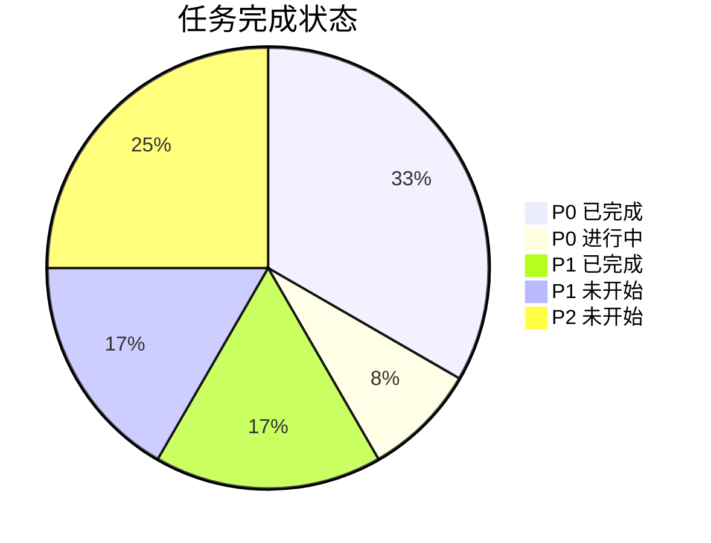
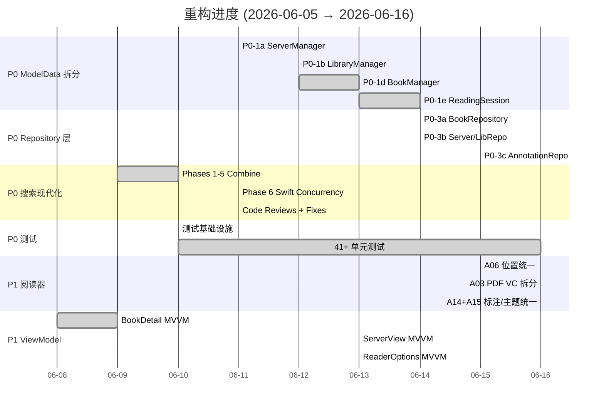
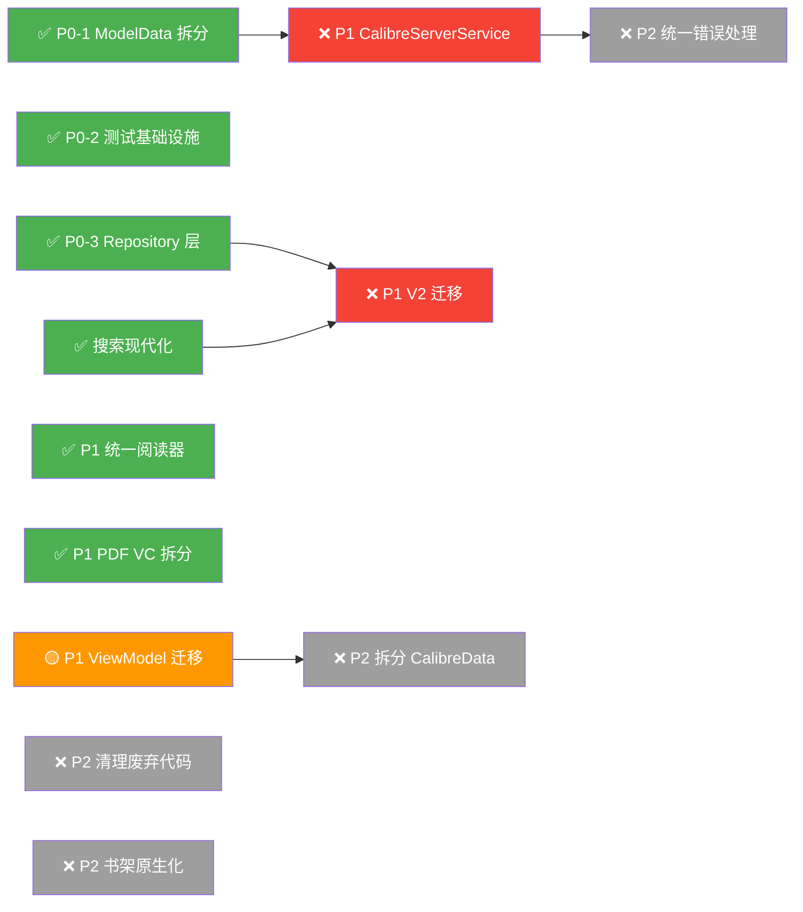

# REFACTOR_PLAN.md — YetAnotherEBookReader (D.S.Reader)

> 基于对全部 88 个 Swift 源文件的完整分析，生成于 2026-06-05
> **最后更新**: 2026-06-16 — 反映 10 天开发进度 (42 commits)

---

## 进度总览



| 指标 | 初始 (06-05) | 当前 (06-16) | 变化 |
|------|-------------|-------------|------|
| **ModelData.swift 行数** | 2,180 | 996 | 🟢 **-54%** |
| **CalibreBrowser.swift 行数** | 2,137 | 1,320 | 🟢 **-38%** |
| **测试文件数** | 1 (占位) | 7 | 🟢 **+600%** |
| **测试代码行数** | ~0 | 2,029 | 🟢 **从零到有** |
| **通过的单元测试** | 0 | 41+ | 🟢 |
| **Views 层 `import RealmSwift` 文件数** | 20+ | 17 | 🟡 **-15%** |
| **总 `import RealmSwift` 文件数** | 36 | 36 | ⚪ (ViewModel 层新增抵消了 View 层减少) |
| **Swift 源文件数** | 88 | 144 | 📈 (+56 新文件，含 Services/Repos/VMs/Tests) |
| **总代码行数** | 28,702 | 31,486 | 📈 (+10%, 含测试+新模块) |

---

## 一、架构问题清单 — 完成状态

### P0 任务 (阻塞后续重构)

| # | 问题 | 初始行数 | 当前行数 | 状态 | 完成日期 | 关键 Commits |
|---|------|---------|---------|------|---------|-------------|
| **A01** | ModelData God Object | 2,180 | 996 | ✅ **已拆分** | 06-12 | `82aae5b` `fe8154b` `8428e19` `dffebdb` |
| **A02** | CalibreBrowser 搜索/缓存巨类 | 2,137 | 1,320 | 🟡 **部分完成** | — | `e366f13` `649cbc5` |
| **A25** | 测试覆盖为零 | 0 tests | 41+ tests | ✅ **已建立** | 06-10 | `8ec1bb8` `f20ad30` |
| **A05** | RealmSwift 泄漏到视图层 | 20+ Views | 17 Views | 🟡 **进行中** | — | `726fc9f` `a7e3317` `64f97a1` |

#### A01: ModelData 拆分详情

从 ModelData 提取出的服务/管理器：

| 提取组件 | 任务编号 | 行数 | 职责 |
|---------|---------|------|------|
| [CalibreServerManager](file:///Users/peterlee/git/YetAnotherEBookReader/YetAnotherEBookReader/Models/Managers/CalibreServerManager.swift) | P0-1a | ~300 | 服务器 CRUD、探测、连接状态 |
| [CalibreLibraryManager](file:///Users/peterlee/git/YetAnotherEBookReader/YetAnotherEBookReader/Models/Managers/CalibreLibraryManager.swift) | P0-1b | ~350 | 图书馆管理、同步状态 |
| [CalibreBookManager](file:///Users/peterlee/git/YetAnotherEBookReader/YetAnotherEBookReader/Models/Managers/CalibreBookManager.swift) | P0-1d | ~400 | 图书 CRUD、元数据、书架管理 |
| [ReadingSessionManager](file:///Users/peterlee/git/YetAnotherEBookReader/YetAnotherEBookReader/Models/ReadingSessionManager.swift) | P0-1e | ~200 | 格式偏好、阅读位置、会话 |

> [!TIP]
> ModelData 现在主要作为**协调者**，持有子管理器实例并转发 `objectWillChange`。向后兼容的委托属性保留，确保 legacy 视图继续编译。

#### A02: CalibreBrowser 搜索现代化详情

| 阶段 | 描述 | 状态 |
|------|------|------|
| Phase 1: 值类型 + Repository 协议 | `UnifiedSearchResult`, `SearchCacheRepository`, `RealmSearchCacheStore` | ✅ |
| Phase 2: Heap 合并算法 | `UnifiedSearchMergeService` + `MergeHead` | ✅ |
| Phase 3: 内存协调器 | `UnifiedSearchManager` (已删除，替换为 actor) | ✅ |
| Phase 4: UI 消费层迁移 | `UnifiedSearchViewModel`, Views 迁移 | ✅ |
| Phase 5: Realm Schema 清理 | 删除 `CalibreUnifiedSearchObject`, 迁移 v138 | ✅ |
| Phase 6: Swift Concurrency | `actor UnifiedSearchService`, `actor LibrarySearchService` | ✅ |
| 剩余: 分类系统迁移 | `CalibreUnifiedCategoryObject` 仍在 Realm | 🟡 |

#### A05: Repository 层引入详情

| Repository | 任务编号 | 状态 | 覆盖范围 |
|-----------|---------|------|---------|
| [RealmSearchCacheStore](file:///Users/peterlee/git/YetAnotherEBookReader/YetAnotherEBookReader/Models/Repositories/RealmSearchCacheStore.swift) | Phase 1 | ✅ | 搜索结果缓存 |
| [BookRepository](file:///Users/peterlee/git/YetAnotherEBookReader/YetAnotherEBookReader/Models/Repositories/BookRepository.swift) | P0-3a | ✅ | 图书 CRUD |
| [RealmServerRepository](file:///Users/peterlee/git/YetAnotherEBookReader/YetAnotherEBookReader/Models/Repositories/RealmServerRepository.swift) | P0-3b | ✅ | 服务器 CRUD |
| [RealmLibraryRepository](file:///Users/peterlee/git/YetAnotherEBookReader/YetAnotherEBookReader/Models/Repositories/RealmLibraryRepository.swift) | P0-3b | ✅ | 图书馆 CRUD |
| [RealmAnnotationRepository](file:///Users/peterlee/git/YetAnotherEBookReader/YetAnotherEBookReader/Models/Repositories/RealmAnnotationRepository.swift) | P0-3c | ✅ | 高亮/书签 |
| [CategoryCacheRepository](file:///Users/peterlee/git/YetAnotherEBookReader/YetAnotherEBookReader/Models/Repositories/CategoryCacheRepository.swift) | — | ✅ | 分类缓存 |

---

### P1 任务 (高价值，可独立完成)

| # | 问题 | 状态 | 完成日期 | 关键 Commits |
|---|------|------|---------|-------------|
| **A06** | 阅读位置三引擎重复 | ✅ **已统一** | 06-15 | `c95c78f` `49defcb` |
| **A03** | YabrPDFViewController 1716行 | ✅ **已拆分** | 06-16 | `7aea6eb` `c6871e3` |
| **A14** | 高亮/标注三引擎重复 | ✅ **已统一** | 06-16 | `d4ae1a3` |
| **A15** | 主题/外观三引擎重复 | ✅ **已统一** | 06-16 | `c4f71ea` |
| **A04** | CalibreServerService 1388行 | ❌ 未开始 | — | — |
| **A08** | 视图层无 ViewModel 分隔 | 🟡 **部分完成** | — | 多个 commits |
| **A09** | DSReaderHelper DispatchQueue.main.sync | ❌ 未开始 | — | — |
| **A18** | V1/V2 共存 | ❌ 未开始 | — | — |

#### A06+A14+A15: 统一阅读引擎抽象层详情

| 组件 | 描述 | 文件 |
|------|------|------|
| `ReaderPositionService` | 统一位置保存/恢复协议 | [ReaderPositionService.swift](file:///Users/peterlee/git/YetAnotherEBookReader/YetAnotherEBookReader/Models/Services/ReaderPositionService.swift) |
| `ReaderEngineDelegate` | 统一引擎回调协议 | 各引擎 VC 实现 |
| `BookBookmark` / `BookHighlight` | 解耦后的标注值类型 | [AnnotationRepository](file:///Users/peterlee/git/YetAnotherEBookReader/YetAnotherEBookReader/Models/Repositories/RealmAnnotationRepository.swift) |
| `PDFAnnotationManager` | 从 PDFViewController 提取 | [PDFAnnotationManager.swift](file:///Users/peterlee/git/YetAnotherEBookReader/YetAnotherEBookReader/Views/PDFView/PDFAnnotationManager.swift) |
| `PDFBookmarkManager` | 从 PDFViewController 提取 | [PDFBookmarkManager.swift](file:///Users/peterlee/git/YetAnotherEBookReader/YetAnotherEBookReader/Views/PDFView/PDFBookmarkManager.swift) |
| `PDFSearchController` | 从 PDFViewController 提取 + Search Tab | [PDFSearchController.swift](file:///Users/peterlee/git/YetAnotherEBookReader/YetAnotherEBookReader/Views/PDFView/PDFSearchController.swift) |

#### A08: ViewModel 引入进度

| 视图 | ViewModel | 状态 |
|------|-----------|------|
| `BookDetailView` | `BookDetailViewModel` | ✅ 完全解耦 |
| `LibraryInfoView` | `LibraryInfoView.ViewModel` + `UnifiedSearchViewModel` + `UnifiedCategoryViewModel` | ✅ |
| `ServerDetailView` | `ServerViewModel` | ✅ |
| `LibraryDetailView` | `LibraryViewModel` | ✅ |
| `ReaderOptionsView` | `ReaderOptionsViewModel` | ✅ |
| `ActivityList` | `ActivityListViewModel` | ✅ |
| `ReadingPositionHistoryView` | `ReadingPositionHistoryViewModel` | ✅ |
| `ReadingPositionDetailView` | `ReadingPositionDetailViewModel` | ✅ |
| `AddModServerView` (542行) | — | ❌ 未开始 |
| `MainView` (419行) | — | ❌ 未开始 |
| `SettingsView` (350行) | — | ❌ 未开始 |

---

### P2 任务 (有益但可延后)

| # | 问题 | 状态 | 备注 |
|---|------|------|------|
| **A07** | Providers.swift ~370行废弃代码 | ❌ 未开始 | |
| **A10** | ShelfDataManager 错放在 Views | ❌ 未开始 | |
| **A11** | CalibreData.swift 1542行 | ❌ 未开始 | |
| **A12+A24** | RealmModel.swift + Readium 耦合 | ❌ 未开始 | |
| **A13** | Book.swift ~200行废弃代码 | ❌ 未开始 | |
| **A16+A17** | BookDetailView + LibraryInfoBookListView 超大 | 🟡 已有 ViewModel | 逻辑已迁移，视图文件仍大 |
| **A19** | 网络层无统一错误处理 | ❌ 未开始 | |
| **A20** | CalibreBrowser Realm force unwrap | 🟡 部分修复 | 搜索路径已修复 |
| **A21** | UIKit/SwiftUI 混合书架 | ❌ 未开始 | |
| **A22** | CalibreSearchCache 废弃属性 | ❌ 未开始 | |
| **A23** | DatabaseService force unwrap | ❌ 未开始 | |
| **A26** | Readium timing hack | ❌ 未开始 | |
| **A27** | Realm ↔ 值类型手动转换 | 🟡 Repository 层部分解决 | |

---

## 二、已完成的重构里程碑

### 里程碑时间线



### 42 Commits 汇总 (2026-06-06 → 2026-06-16)

| 类别 | Commits | 描述 |
|------|---------|------|
| **ModelData 拆分** | 7 | Server/Library/Book Manager + ReadingSession 提取 |
| **搜索现代化** | 14 | Phases 1-6 + Code Review 修复 |
| **Repository 层** | 5 | Book/Server/Library/Annotation/Category Repository |
| **阅读器统一** | 5 | Position/Highlight/Theme 合并 + PDF VC 拆分 |
| **MVVM 迁移** | 6 | BookDetail/Server/Library/ReaderOptions/Activity/Position ViewModels |
| **Bug 修复** | 5 | Realm 线程安全、SwiftUI 崩溃、UI 状态 |

---

## 三、更新的重构优先级矩阵

| 优先级 | 问题编号 | 任务描述 | 状态 | 预计剩余工作量 |
|--------|---------|---------|------|--------------|
| **P0** | A01 | 拆分 ModelData God Object | ✅ 完成 | — |
| **P0** | A25 | 建立测试基础设施 | ✅ 完成 | — |
| **P0** | A05 | Repository 层隔离 Realm | ✅ 核心完成 | Views 层仍有 17 个文件 |
| **P0** | A02 | 搜索/浏览现代化 | ✅ 搜索完成 | 分类系统待迁移 |
| **P1** | A06+A14+A15 | 统一阅读引擎抽象层 | ✅ 完成 | — |
| **P1** | A03 | 拆分 YabrPDFViewController | ✅ 完成 | — |
| **P1** | A08 | 为主要视图引入 ViewModel | 🟡 60% | AddModServer/Main/Settings |
| **P1** | A04 | 重构 CalibreServerService | ❌ 未开始 | ~3 天 |
| **P1** | A09 | 重构 DSReaderHelper 线程安全 | ❌ 未开始 | ~0.5 天 |
| **P1** | A18 | 完成 V2 迁移 | ❌ 未开始 | ~2 天 |
| **P2** | A07+A13+A22 | 清理废弃代码 | ❌ 未开始 | ~1 天 |
| **P2** | A11 | 拆分 CalibreData.swift | ❌ 未开始 | ~1 天 |
| **P2** | A12+A24 | RealmModel + Readium 解耦 | ❌ 未开始 | ~2 天 |
| **P2** | A10 | 移动 ShelfDataManager | ❌ 未开始 | ~0.5 天 |
| **P2** | A19 | 统一网络错误处理 | ❌ 未开始 | ~2 天 |
| **P2** | A21 | 书架 SwiftUI 原生化 | ❌ 未开始 | ~3 天 |

---

## 四、剩余工作计划

### 近期重点 (Week 3)

```
第3周 ─── 收尾 P1 + 开始 P2 快速任务 ──────────────────────
├── [P1-A08] 剩余 ViewModel 迁移
│   ├── AddModServerView (542行) → AddModServerViewModel
│   ├── MainView (419行) → 简化直接引用
│   └── SettingsView (350行) → SettingsViewModel
├── [P1-A09] 修复 DSReaderHelperConnector.main.sync (快速)
├── [P2] 清理废弃代码 (A07+A13+A22) — 低风险，快速减负
│   ├── 删除 Providers.swift L330-700 废弃代码
│   ├── 删除 Book.swift 4 个废弃结构体
│   └── 清理 CalibreSearchCache 废弃属性
└── [P0-A05] 继续减少 Views 层 RealmSwift 导入 (目标: <10)
```

### 中期目标 (Week 4-5)

```
第4-5周 ─── 网络层 + CalibreBrowser 完成迁移 ──────────────
├── [P1-A04] 重构 CalibreServerService
│   ├── 引入 CalibreAPIError 统一错误类型
│   ├── 按端点拆分方法
│   └── async/await 迁移 (搜索已完成，扩展到其他端点)
├── [P1-A18] 完成 V2 迁移
│   └── 废弃 CalibreBrowser V1 分类系统
├── [P2-A11] 拆分 CalibreData.swift
└── [P2-A10] 移动 ShelfDataManager 到 Models
```

### 长期目标

```
后续 ─── 深度解耦 + 现代化 ──────────────────────────────
├── [P2-A12+A24] RealmModel 拆分 + Readium 类型解耦
├── [P2-A21] 书架视图 SwiftUI 原生化
├── [P2-A19] 统一网络错误处理
└── 持续提升测试覆盖率
```

### 更新的依赖关系图



> **关键路径更新**：P0 全部完成 ✅ → P1 剩余 (A04 + A08 + A18) → P2 (并行)
