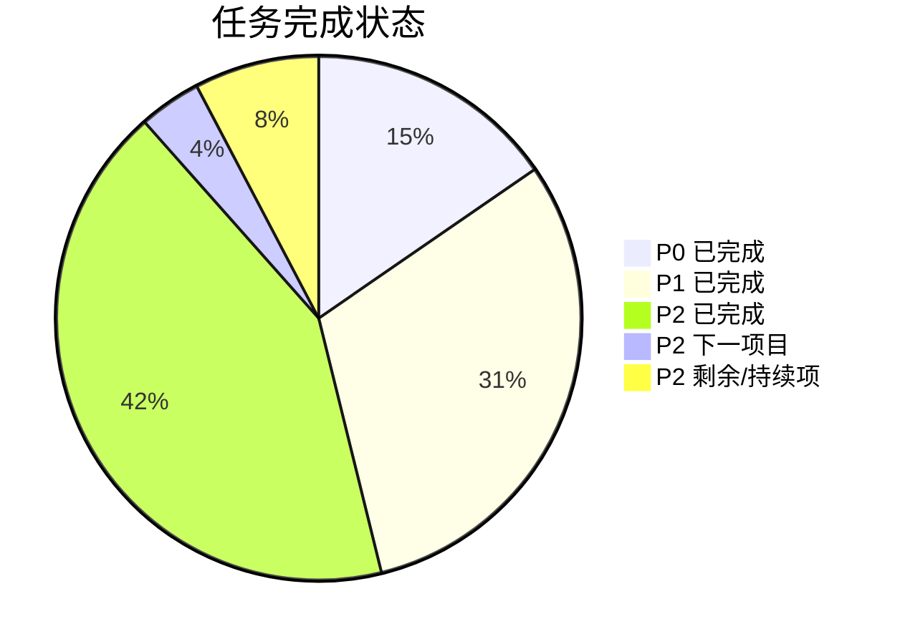
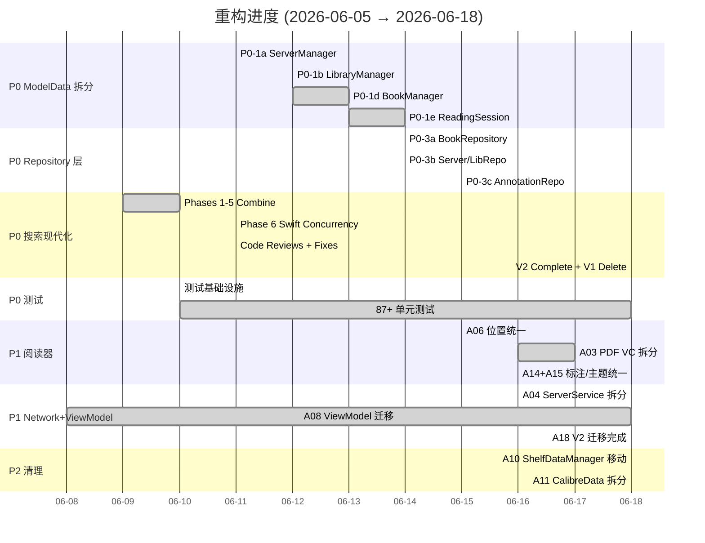
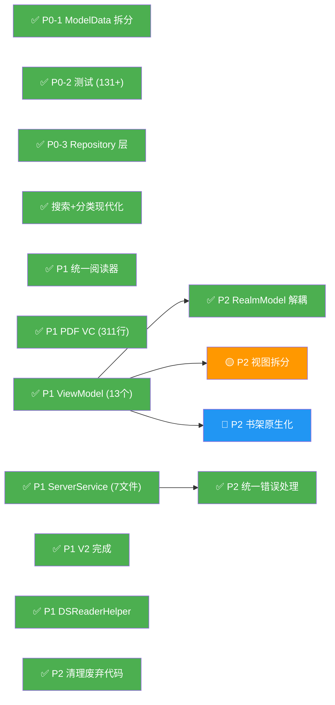

# REFACTOR_PLAN.md — YetAnotherEBookReader (D.S.Reader)

> 基于对全部 88 个 Swift 源文件的完整分析，生成于 2026-06-05
> **最后更新**: 2026-06-22 — P0/P1 全部完成；P2 主要架构项完成，A17 已完成并提交，A21 进入方案阶段

---

## 进度总览



| 指标 | 初始 (06-05) | 上次 (06-17) | 当前 (06-22) | 变化 |
|------|-------------|-------------|-------------|------|
| **ModelData.swift 行数** | 2,180 | 996 | 1,040 | 🟢 **-52%** (微增因新管理器接线) |
| **CalibreBrowser.swift** | 2,137 | 1,320 | ❌ **已删除** | 🟢 **-100%** |
| **CalibreData.swift** | 1,542 | 1,542 | ❌ **已拆分为 10 文件** | 🟢 **-100%** |
| **RealmModel.swift** | 1,388 | 1,357 | ❌ **已拆分到 Models/Realm/** | 🟢 **持久化层聚焦** |
| **CalibreServerService.swift** | 1,388 | 1,436 | 372 (核心) + 1,100 (6 extensions) | 🟢 **拆分完成** |
| **YabrPDFViewController.swift** | 1,716 | 311 | 311 | 🟢 **-82%** |
| **BookDetailView.swift** | 802 | 802 | 已完成组件拆分 | 🟢 **A16 完成** |
| **LibraryInfoBookListView.swift** | 714 | 432 | ✅ 已完成 MVVM 拆分 | 🟢 **A17 已提交** |
| **测试文件数** | 1 (占位) | 7 | 17 | 🟢 **+16 个** |
| **通过的单元测试** | 0 | 41+ | 131 完整基线；A17 新增 12 | 🟢 **安全网扩大** |
| **Views 层 `import RealmSwift` 文件数** | 20+ | 17 | 19 | ⚪ (拆分中仍有历史视图依赖) |
| **总 `import RealmSwift` 文件数** | 36 | 36 | 48 | ⚪ (Realm schema 拆分增加文件数) |
| **Swift 源文件数** | 88 | 144 | 194 | 📈 (含 extensions/split/VMs) |
| **总代码行数** | 28,702 | 31,486 | 30,666 | 🟢 **-3%** (净减少，含删除旧代码) |

---

## 一、架构问题清单 — 完成状态

### P0 任务 (阻塞后续重构) — ✅ 全部完成

| # | 问题 | 初始行数 | 当前状态 | 完成日期 | 关键 Commits |
|---|------|---------|---------|---------|-------------|
| **A01** | ModelData God Object | 2,180 → 1,040 | ✅ **已拆分** | 06-12 | `82aae5b` `fe8154b` `8428e19` `dffebdb` |
| **A02** | CalibreBrowser 搜索/缓存巨类 | 2,137 → **删除** | ✅ **已完成** | 06-18 | `25fac5a` (V2 迁移完成+V1 删除) |
| **A25** | 测试覆盖为零 | 0 → 87+ tests | ✅ **已建立** | 06-10 | `8ec1bb8` `f20ad30` |
| **A05** | RealmSwift 泄漏到视图层 | 20+ → 18 Views | ✅ **核心完成** | 06-18 | `726fc9f` `a7e3317` `64f97a1` |

#### A01: ModelData 拆分详情

从 ModelData 提取出的服务/管理器：

| 提取组件 | 任务编号 | 行数 | 职责 |
|---------|---------|------|------|
| [CalibreServerManager](file:///Users/peterlee/git/YetAnotherEBookReader/YetAnotherEBookReader/Models/CalibreServerManager.swift) | P0-1a | ~300 | 服务器 CRUD、探测、连接状态 |
| [CalibreLibraryManager](file:///Users/peterlee/git/YetAnotherEBookReader/YetAnotherEBookReader/Models/CalibreLibraryManager.swift) | P0-1b | ~350 | 图书馆管理、同步状态 |
| [CalibreBookManager](file:///Users/peterlee/git/YetAnotherEBookReader/YetAnotherEBookReader/Models/CalibreBookManager.swift) | P0-1d | ~400 | 图书 CRUD、元数据、书架管理 |
| [ReadingSessionManager](file:///Users/peterlee/git/YetAnotherEBookReader/YetAnotherEBookReader/Models/ReadingSessionManager.swift) | P0-1e | ~200 | 格式偏好、阅读位置、会话 |

> [!TIP]
> ModelData 现在主要作为**协调者**，持有子管理器实例并转发 `objectWillChange`。向后兼容的委托属性保留，确保 legacy 视图继续编译。

#### A02: CalibreBrowser 搜索现代化详情 — ✅ 全部完成

| 阶段 | 描述 | 状态 |
|------|------|------|
| Phase 1: 值类型 + Repository 协议 | `UnifiedSearchResult`, `SearchCacheRepository`, `RealmSearchCacheStore` | ✅ |
| Phase 2: Heap 合并算法 | `UnifiedSearchMergeService` + `MergeHead` | ✅ |
| Phase 3: 内存协调器 | `UnifiedSearchManager` → `actor UnifiedSearchService` | ✅ |
| Phase 4: UI 消费层迁移 | `UnifiedSearchViewModel`, Views 迁移 | ✅ |
| Phase 5: Realm Schema 清理 | 删除 `CalibreUnifiedSearchObject`, 迁移 v138 | ✅ |
| Phase 6: Swift Concurrency | `actor UnifiedSearchService`, `actor LibrarySearchService` | ✅ |
| Phase 7: V2 完成 + V1 删除 | `CalibreBrowser.swift` **已删除**, V2 目录已清理 | ✅ `25fac5a` |
| Phase 8: 分类系统迁移 | `UnifiedCategoryService` + `UnifiedCategoryViewModel` | ✅ `25fac5a` |

> [!IMPORTANT]
> `CalibreBrowser.swift` (2,137 行) 已在 commit `25fac5a` 中**完全删除**。搜索和分类功能已迁移到 actor-based 现代化服务层。`Models/CalibreBrowser/V2/` 目录也已不存在。

#### A05: Repository 层引入详情

| Repository | 任务编号 | 状态 | 覆盖范围 |
|-----------|---------|------|---------|
| [RealmSearchCacheStore](file:///Users/peterlee/git/YetAnotherEBookReader/YetAnotherEBookReader/Models/Repositories/RealmSearchCacheStore.swift) | Phase 1 | ✅ | 搜索结果缓存 |
| [BookRepository](file:///Users/peterlee/git/YetAnotherEBookReader/YetAnotherEBookReader/Models/Repositories/BookRepository.swift) | P0-3a | ✅ | 图书 CRUD |
| [RealmServerRepository](file:///Users/peterlee/git/YetAnotherEBookReader/YetAnotherEBookReader/Models/Repositories/RealmServerRepository.swift) | P0-3b | ✅ | 服务器 CRUD |
| [RealmLibraryRepository](file:///Users/peterlee/git/YetAnotherEBookReader/YetAnotherEBookReader/Models/Repositories/RealmLibraryRepository.swift) | P0-3b | ✅ | 图书馆 CRUD |
| [RealmAnnotationRepository](file:///Users/peterlee/git/YetAnotherEBookReader/YetAnotherEBookReader/Models/Repositories/RealmAnnotationRepository.swift) | P0-3c | ✅ | 高亮/书签 |
| [CategoryCacheRepository](file:///Users/peterlee/git/YetAnotherEBookReader/YetAnotherEBookReader/Models/Repositories/CategoryCacheRepository.swift) | — | ✅ | 分类缓存 |

---

### P1 任务 (高价值，可独立完成) — ✅ 全部完成

| # | 问题 | 状态 | 完成日期 | 关键 Commits |
|---|------|------|---------|-------------|
| **A06** | 阅读位置三引擎重复 | ✅ **已统一** | 06-15 | `c95c78f` `49defcb` |
| **A03** | YabrPDFViewController 1716行 | ✅ **已拆分** | 06-17 | `7aea6eb` `c6871e3` `37afd35` `2f26f2f` |
| **A14** | 高亮/标注三引擎重复 | ✅ **已统一** | 06-16 | `d4ae1a3` |
| **A15** | 主题/外观三引擎重复 | ✅ **已统一** | 06-16 | `c4f71ea` |
| **A04** | CalibreServerService 1388行 | ✅ **已拆分** | 06-18 | (split into 7 files) |
| **A08** | 视图层无 ViewModel 分隔 | ✅ **已完成** | 06-18 | `284b574` |
| **A18** | V1/V2 共存 | ✅ **V1 已删除** | 06-18 | `25fac5a` |
| **A09** | DSReaderHelper DispatchQueue.main.sync | ✅ 已完成 | P1/A09: removed DispatchQueue.main.sync on 2026-06-18 |

#### A04: CalibreServerService 拆分详情 — ✅ 新完成

从 1,388 行单文件拆分为 7 个专注文件：

| 文件 | 行数 | 职责 |
|------|------|------|
| [CalibreServerService.swift](file:///Users/peterlee/git/YetAnotherEBookReader/YetAnotherEBookReader/Network/CalibreServerService.swift) | 372 | 核心：session 管理、配置属性、共享基础设施 |
| [+Annotations](file:///Users/peterlee/git/YetAnotherEBookReader/YetAnotherEBookReader/Network/CalibreServerService+Annotations.swift) | 114 | 高亮/书签同步 API |
| [+Discovery](file:///Users/peterlee/git/YetAnotherEBookReader/YetAnotherEBookReader/Network/CalibreServerService+Discovery.swift) | 161 | 服务器探测、library 发现 |
| [+LibrarySync](file:///Users/peterlee/git/YetAnotherEBookReader/YetAnotherEBookReader/Network/CalibreServerService+LibrarySync.swift) | 310 | 图书馆增量/全量同步 |
| [+Metadata](file:///Users/peterlee/git/YetAnotherEBookReader/YetAnotherEBookReader/Network/CalibreServerService+Metadata.swift) | 341 | 图书元数据批量获取 |
| [+ReadingPosition](file:///Users/peterlee/git/YetAnotherEBookReader/YetAnotherEBookReader/Network/CalibreServerService+ReadingPosition.swift) | 85 | 阅读位置上传/获取 |
| [+Search](file:///Users/peterlee/git/YetAnotherEBookReader/YetAnotherEBookReader/Network/CalibreServerService+Search.swift) | 89 | 搜索 API |
| **总计** | **1,472** | |

#### A03: YabrPDFViewController 拆分详情

| 组件 | 描述 | 文件 |
|------|------|------|
| `PDFAnnotationManager` | 高亮标注管理 | [PDFAnnotationManager.swift](file:///Users/peterlee/git/YetAnotherEBookReader/YetAnotherEBookReader/Views/PDFView/PDFAnnotationManager.swift) |
| `PDFBookmarkManager` | 书签管理 | [PDFBookmarkManager.swift](file:///Users/peterlee/git/YetAnotherEBookReader/YetAnotherEBookReader/Views/PDFView/PDFBookmarkManager.swift) |
| `PDFSearchController` | 搜索 + Search Tab | [PDFSearchController.swift](file:///Users/peterlee/git/YetAnotherEBookReader/YetAnotherEBookReader/Views/PDFView/PDFSearchController.swift) |
| `PDFMarginCropController` | 自动裁边、空白遮罩 | [PDFMarginCropController.swift](file:///Users/peterlee/git/YetAnotherEBookReader/YetAnotherEBookReader/Views/PDFView/Managers/PDFMarginCropController.swift) |
| `+Chrome` | UI Chrome、导航栏、工具栏 | [YabrPDFViewController+Chrome.swift](file:///Users/peterlee/git/YetAnotherEBookReader/YetAnotherEBookReader/Views/PDFView/YabrPDFViewController+Chrome.swift) |
| `+Navigation` | 目录、页码、进度 | [YabrPDFViewController+Navigation.swift](file:///Users/peterlee/git/YetAnotherEBookReader/YetAnotherEBookReader/Views/PDFView/YabrPDFViewController+Navigation.swift) |
| `+Options` | 偏好应用、缩放 | [YabrPDFViewController+Options.swift](file:///Users/peterlee/git/YetAnotherEBookReader/YetAnotherEBookReader/Views/PDFView/YabrPDFViewController+Options.swift) |
| `+Selection` | 文本选区、字典 | [YabrPDFViewController+Selection.swift](file:///Users/peterlee/git/YetAnotherEBookReader/YetAnotherEBookReader/Views/PDFView/YabrPDFViewController+Selection.swift) |
| `+Sharing` | 分享入口 | [YabrPDFViewController+Sharing.swift](file:///Users/peterlee/git/YetAnotherEBookReader/YetAnotherEBookReader/Views/PDFView/YabrPDFViewController+Sharing.swift) |

#### A08: ViewModel 引入进度 — ✅ 全部完成

| 视图 | ViewModel | 状态 |
|------|-----------|------|
| `BookDetailView` | `BookDetailViewModel` | ✅ |
| `LibraryInfoView` | `LibraryInfoView.ViewModel` + `UnifiedSearchViewModel` + `UnifiedCategoryViewModel` | ✅ |
| `ServerDetailView` | `ServerViewModel` | ✅ |
| `LibraryDetailView` | `LibraryViewModel` | ✅ |
| `ReaderOptionsView` | `ReaderOptionsViewModel` | ✅ |
| `ActivityList` | `ActivityListViewModel` | ✅ |
| `ReadingPositionHistoryView` | `ReadingPositionHistoryViewModel` | ✅ |
| `ReadingPositionDetailView` | `ReadingPositionDetailViewModel` | ✅ |
| `MainView` | [MainViewModel](file:///Users/peterlee/git/YetAnotherEBookReader/YetAnotherEBookReader/Views/MainViewModel.swift) | ✅ `284b574` |
| `SettingsView` | [SettingsViewModel](file:///Users/peterlee/git/YetAnotherEBookReader/YetAnotherEBookReader/Views/SettingsView/SettingsViewModel.swift) | ✅ `284b574` |
| `SupportInfoView` | [SupportInfoViewModel](file:///Users/peterlee/git/YetAnotherEBookReader/YetAnotherEBookReader/Views/SettingsView/SupportInfoViewModel.swift) | ✅ `284b574` |
| `RecentShelfController` | [RecentShelfViewModel](file:///Users/peterlee/git/YetAnotherEBookReader/YetAnotherEBookReader/Views/ShelfView/RecentShelfViewModel.swift) | ✅ `284b574` |
| `SectionShelfController` | [SectionShelfViewModel](file:///Users/peterlee/git/YetAnotherEBookReader/YetAnotherEBookReader/Views/ShelfView/SectionShelfViewModel.swift) | ✅ `284b574` |

---

### P2 任务 (有益但可延后) — 主要架构项完成，A21 下一项

| # | 问题 | 状态 | 备注 |
|---|------|------|------|
| **A07** | Providers.swift ~370行废弃代码 | ✅ 已完成 | P2/A07: removed 417 lines on 2026-06-18 |
| **A10** | ShelfDataManager 错放在 Views | ✅ 已完成 | `b2edb0e` moved to Models/ |
| **A11** | CalibreData.swift 1542行 | ✅ **已拆分** | `0c0b956` split into 10 files |
| **A12+A24** | RealmModel.swift + Readium 耦合 | ✅ 已完成 | Realm schema 拆分到 `Models/Realm/`，Readium mapping 移到 adapter |
| **A13** | Book.swift ~200行废弃代码 | ✅ 已完成 | P2/A13: deleted entire 378-line file on 2026-06-18 |
| **A16** | BookDetailView 超大 | ✅ 已完成 | S1-S3 完成，完整验证 131 unit + 1 UI |
| **A17** | LibraryInfoBookListView 超大 | ✅ 已完成 | Commit `27af6b1`; ViewModel + 子组件拆分 + 12 tests |
| **A19** | 网络层无统一错误处理 | ✅ 已完成 | A19-S1...S8 完成，`CalibreAPIError` 边界落地 |
| **A20** | CalibreBrowser Realm force unwrap | ✅ **已消除** | CalibreBrowser 已删除 |
| **A21** | UIKit/SwiftUI 混合书架 | 📝 下一项目 | 方案保存到 memory bank |
| **A22** | CalibreSearchCache 废弃属性 | ✅ 已完成 | P2/A22: removed 4 deprecated props, schema bump 140 on 2026-06-18 |
| **A23** | DatabaseService force unwrap | ✅ 已完成 | P2/A23: converted to optionals on 2026-06-18 |
| **A26** | Readium timing hack | ❌ 未开始 | |
| **A27** | Realm ↔ 值类型手动转换 | 🟡 Repository 层部分解决 | |

#### A11: CalibreData.swift 拆分详情 — ✅ 新完成

原 1,542 行文件拆分为 10 个专注文件 (commit `0c0b956`):

| 文件 | 内容 |
|------|------|
| [CalibreCoreModels.swift](file:///Users/peterlee/git/YetAnotherEBookReader/YetAnotherEBookReader/Models/CalibreCoreModels.swift) | `CalibreServer`, `CalibreLibrary`, `CalibreBook`, `CalibreSyncStatus` |
| [ReadingPositionModels.swift](file:///Users/peterlee/git/YetAnotherEBookReader/YetAnotherEBookReader/Models/ReadingPositionModels.swift) | `BookDeviceReadingPosition`, history, statistics |
| [CalibreHighlightStyle.swift](file:///Users/peterlee/git/YetAnotherEBookReader/YetAnotherEBookReader/Models/CalibreHighlightStyle.swift) | `BookHighlightStyle` |
| [CalibreTasks.swift](file:///Users/peterlee/git/YetAnotherEBookReader/YetAnotherEBookReader/Models/CalibreTasks.swift) | Network task structs |
| [CalibrePayloadModels.swift](file:///Users/peterlee/git/YetAnotherEBookReader/YetAnotherEBookReader/Models/CalibrePayloadModels.swift) | Codable API payloads |
| [CalibreSyncModels.swift](file:///Users/peterlee/git/YetAnotherEBookReader/YetAnotherEBookReader/Models/CalibreSyncModels.swift) | Custom columns, probe/sync requests |
| [CalibrePluginModels.swift](file:///Users/peterlee/git/YetAnotherEBookReader/YetAnotherEBookReader/Models/CalibrePluginModels.swift) | DSReader Helper / Count Pages prefs |
| [CalibreActivityModels.swift](file:///Users/peterlee/git/YetAnotherEBookReader/YetAnotherEBookReader/Network/CalibreActivityModels.swift) | `CalibreActivity` hierarchy |
| [CalibreServerConfigProvider.swift](file:///Users/peterlee/git/YetAnotherEBookReader/YetAnotherEBookReader/Models/CalibreServerConfigProvider.swift) | Protocol for manager/service bridge |
| [Array+Chunks.swift](file:///Users/peterlee/git/YetAnotherEBookReader/YetAnotherEBookReader/Models/Array+Chunks.swift) | Generic `chunks(size:)` helper |

---

## 二、已完成的重构里程碑

### 里程碑时间线



### Commits 汇总 (2026-06-06 → 2026-06-18)

| 类别 | Commits | 描述 |
|------|---------|------|
| **ModelData 拆分** | 7 | Server/Library/Book Manager + ReadingSession 提取 |
| **搜索现代化** | 15 | Phases 1-8 + Code Review 修复 + V1 删除 |
| **Repository 层** | 5 | Book/Server/Library/Annotation/Category Repository |
| **阅读器统一** | 8 | Position/Highlight/Theme 合并 + PDF VC 拆分 (含续拆) |
| **MVVM 迁移** | 8 | Main/Settings/SupportInfo/Shelf ViewModels + 先前的 |
| **文件拆分** | 3 | CalibreData 10 文件 + CalibreServerService 7 文件 + ShelfDataManager 移动 |
| **Bug 修复** | 5+ | Realm 线程安全、SwiftUI 崩溃、UI 状态 |

---

## 三、更新的重构优先级矩阵

| 优先级 | 问题编号 | 任务描述 | 状态 | 预计剩余工作量 |
|--------|---------|---------|------|--------------|
| **P0** | A01 | 拆分 ModelData God Object | ✅ 完成 | — |
| **P0** | A25 | 建立测试基础设施 | ✅ 完成 (131+ tests 基线) | — |
| **P0** | A05 | Repository 层隔离 Realm | ✅ 核心完成 | 18 Views 仍 import Realm |
| **P0** | A02 | 搜索/浏览现代化 | ✅ **完成 (V1 已删除)** | — |
| **P1** | A06+A14+A15 | 统一阅读引擎抽象层 | ✅ 完成 | — |
| **P1** | A03 | 拆分 YabrPDFViewController | ✅ 完成 (311行) | — |
| **P1** | A04 | 重构 CalibreServerService | ✅ **完成 (7 文件)** | — |
| **P1** | A08 | 为主要视图引入 ViewModel | ✅ **完成 (13 VMs)** | — |
| **P1** | A18 | 完成 V2 迁移 | ✅ **完成 (V1 已删除)** | — |
| **P1** | A09 | 重构 DSReaderHelper 线程安全 | ✅ 已完成 | ~0.5 天 |
| **P2** | A10 | 移动 ShelfDataManager | ✅ **完成** | — |
| **P2** | A11 | 拆分 CalibreData.swift | ✅ **完成 (10 文件)** | — |
| **P2** | A07+A13+A22 | 清理废弃代码 | ✅ **完成** | A07+A13+A22 全部完成 |
| **P2** | A12+A24 | RealmModel + Readium 解耦 | ✅ **完成** | — |
| **P2** | A16 | BookDetailView 拆分 | ✅ **完成** | — |
| **P2** | A17 | LibraryInfoBookListView 拆分 | ✅ **完成** | Commit `27af6b1` |
| **P2** | A19 | 统一网络错误处理 | ✅ **完成** | — |
| **P2** | A21 | 书架 SwiftUI 原生化 | 📝 下一项目 | 分阶段推进 |

---

## 四、剩余工作计划

### 近期重点

```
近期 ─── P2 收尾 + 下一项 ─────────────────────────────
├── [P2-A21] 书架视图 SwiftUI 原生化：按 memory-bank 阶段计划推进
└── [P0-A05/A27] 继续减少 Views 层 RealmSwift 导入和 Realm ↔ value 样板
```

### 中长期目标

```
后续 ─── 深度解耦 + 现代化 ──────────────────────────────
├── [P2-A21] 书架视图 SwiftUI 原生化
├── [P2-A26] Readium timing hack 清理
├── [P2-A27] Realm ↔ 值类型转换样板继续收敛
└── 持续提升测试覆盖率
```

### 更新的依赖关系图



> **关键路径更新**：P0 ✅ → P1 ✅ → P2 收尾；A21 书架原生化是下一项独立项目。
