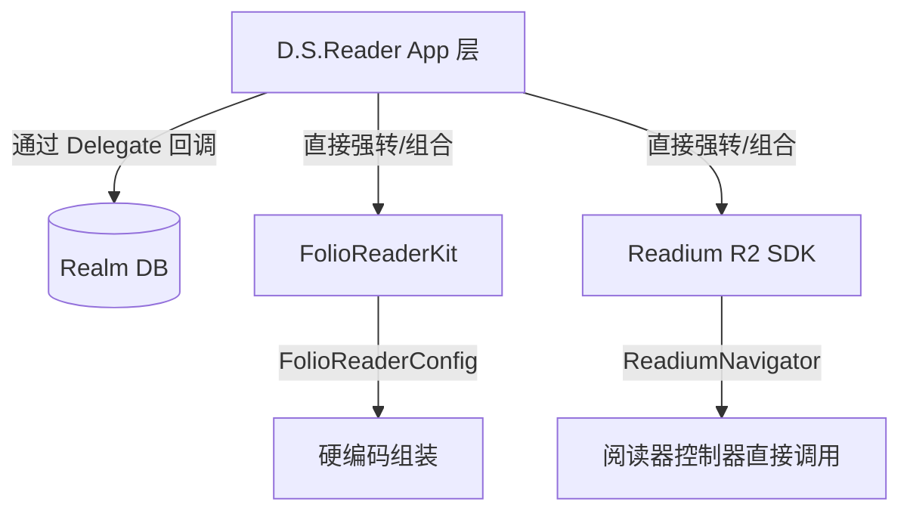

# 📚 YetAnotherEBookReader 架构重构计划 (REFACTOR_PLAN.md)

## 一、项目现状速览

### 核心目录结构
当前项目业务逻辑主要集中在以下核心目录，呈现出典型的按照功能而非业务域划分的特征：
- **`Models/`**: 数据流中心。包含重灾区 `ModelData.swift`（God Object 全局状态引擎）、Realm 数据库交互模块。
- **`Network/`**: 网络层。包含 `CalibreServerService.swift`（Calibre API 通信）和相关的下载管理器。
- **`Views/`**: UI 界面展示层。混杂了庞大的基础 SwiftUI 视图（如 `BookDetailView.swift`）和针对第三方阅读器引擎的二次封装（`FolioReaderView/`、`ReadiumView/`、`PDFView/`）。
- **`ViewController/`**: 历史遗留框架或必须使用 UIKit 桥接的底层逻辑。

### 技术债总量估算
- **代码总量**：约 30,000 行纯 Swift 代码（不含测试和子模块）。
- **头部巨石文件 (Massive Files)**：
  1. `ModelData.swift` (2180 行)：包含了几乎所有全局状态。
  2. `CalibreBrowser.swift` (2136 行)：耦合了复杂的检索逻辑和UI流。
  3. `YabrPDFViewController.swift` (1716 行)：业务与底层的强耦合点。
  4. `CalibreData.swift` (1542 行) & `CalibreServerService.swift` (1388 行)：Calibre 相关业务过于庞大。
- **问题类型分布**：架构职责边界模糊（45%）、视图逻辑与数据拉取深度耦合（30%）、底层第三方库（阅读器）抽象泄露与强绑定（20%）、跨端适配（Catalyst）逻辑散落（5%）。

---

## 二、架构问题清单

### [P0-1] 全局 God Object `ModelData.swift`
- **位置**：`/Users/peterlee/git/YetAnotherEBookReader/YetAnotherEBookReader/Models/ModelData.swift` (Line 20-150)
- **现象**：作为系统唯一的 `@EnvironmentObject`，包含了多达几十个 `@Published` 属性。既有纯 UI 状态（`activeTab`）、设备信息（`deviceName`），又涵盖了 Realm 数据库对象、网络通讯（`calibreServers`）以及下载管理。
- **影响**：完全打破了单一职责原则。任何一个局部状态的改变（如背景下载进度变化），都有可能导致依赖了 `ModelData` 的所有根视图树被迫重建刷新，是性能瓶颈与多线程竞态条件的核心元凶。
- **严重程度**：🔴 高

### [P0-2] 极度臃肿的 PDF 视图控制器
- **位置**：`/Users/peterlee/git/YetAnotherEBookReader/YetAnotherEBookReader/Views/PDFView/YabrPDFViewController.swift` (全文件，共计 1716 行)
- **现象**：将 `PDFKit` 原生交互手势、高亮生成算法、坐标轴转换逻辑，以及直接与 CoreData/Realm 通信存储书签的行为全部糅合在一个 Controller 里。
- **影响**：代码复杂度极高，难以单独为其编写单元测试。UI 逻辑和数据库读写混合，导致后期扩展 PDF 标注能力或重构数据库层时极易引发 Bug。
- **严重程度**：🔴 高

### [P1-1] 缺乏阅读器抽象层（被引擎绑架）
- **位置**：`/Users/peterlee/git/YetAnotherEBookReader/YetAnotherEBookReader/Views/FolioReaderView/EpubFolioReaderContainer.swift` & `/ViewController/FolioReaderViewController.swift`
- **现象**：业务层直接重写并持有 `FolioReaderKit` 以及 `Readium` 的底层具体类（如 `FolioReaderConfig` 的直接注入）。数据模型转换（进度、高亮）直接通过内部的自定义 Delegate 修改 Realm 数据库，跨越了应有的业务层。
- **影响**：如果未来需要平滑迁移到纯 Readium 架构，或者更新底层框架，都需要大面积修改视图层代码，架构弹性极差。
- **严重程度**：🟡 中

### [P1-2] SwiftUI 视图大爆炸
- **位置**：`/Users/peterlee/git/YetAnotherEBookReader/YetAnotherEBookReader/Views/BookDetailView/BookDetailView.swift` (全文件，802 行)
- **现象**：单一 SwiftUI 文件的 `body` 块嵌套层级过深，充斥着复杂的 `if-else` 条件判断、内联的 ViewModel 逻辑、以及 `#if canImport(GoogleMobileAds)` 这样的外部广告宏命令。
- **影响**：UI 难以调整，难以复用。开发者阅读代码时大脑堆栈极易溢出。
- **严重程度**：🟡 中

### [P2-1] macOS Catalyst 适配呈碎片化
- **位置**：`/Users/peterlee/git/YetAnotherEBookReader/YetAnotherEBookReader/MainView.swift` 及各大基础组件
- **现象**：没有使用统一的平台差异抽象策略，而是依赖散落在业务代码中的 `@available(macCatalyst 14.0, *)` 进行方法分发。
- **影响**：Catalyst 版本本质上是 iPad UI 的平移，未能充分利用 macOS 的原生 Menu Bar、多窗口与触控板优势；代码不优雅。
- **严重程度**：🟢 低

---

## 三、重构优先级矩阵

| 优先级 | 问题编号 | 任务描述 | 影响范围 | 难度 | 预计改动文件数 |
| :--- | :--- | :--- | :--- | :--- | :--- |
| **P0** | P0-1 | 拆解 `ModelData.swift` 为独立的模块化 Service | 全局 (极广) | 高 | 50+ |
| **P0** | P0-2 | 重构 `YabrPDFViewController`，抽离 ViewModel | 局部 (PDF模块) | 中 | 10-15 |
| **P1** | P1-1 | 建立 Reader 协议抽象层，隔离第三方阅读器引擎 | 核心 (广) | 高 | 20+ |
| **P1** | P1-2 | `BookDetailView.swift` 等庞大 UI 的组件化与 VM 提取 | 局部 (UI) | 低 | 5-10 |
| **P2** | P2-1 | 抽象 Platform Adapter，集中处理跨平台体验分歧 | 跨端适配 | 中 | ~15 |

---

## 四、P0 任务详细说明

### P0-1：拆解 ModelData God Object

- **涉及文件**：
  - `YetAnotherEBookReader/Models/ModelData.swift`
  - `YetAnotherEBookReader/YetAnotherEBookReaderApp.swift`
  - 各类依赖 `@EnvironmentObject` 的基础视图层。
- **当前状态**：
  ```swift
  class ModelData: ObservableObject {
      @Published var activeTab = 0
      @Published var calibreServers = [String: CalibreServer]()
      @Published var updatingMetadata = false 
      // 几千行的逻辑混合
  }
  ```
- **目标状态**：按业务域进行依赖反转和状态切分：
  1. `AppState`: 只管纯 UI 层级的全局状态交互。
  2. `DBManager`: 负责管理 Realm/DB 数据生命周期。
  3. `NetworkSyncService`: 负责 Calibre 状态管理。
- **执行步骤**：
  1. 新建对应的三个独立 `ObservableObject` 服务类。
  2. 采用 Facade 模式或直接在 `App` 入口将新服务通过 `.environmentObject()` 分别注入。
  3. 检索全库的 `var modelData: ModelData`，依据具体视图需要的领域数据，替换为对应的新注入对象（缩小视图的数据订阅范围）。
  4. 迁移完成后删除原有的 `ModelData` 定义。
- **验收标准**：
  - `xcodebuild -scheme YetAnotherEBookReader -sdk iphonesimulator build` 编译 0 报错。
  - 在 Instruments 中观察 SwiftUI 的 View 刷新频次（Redraw），在进行网络下载时，阅读器界面和书架列表不会发生非预期的全量重绘。
- **注意事项**：Realm 对象存在严格的线程安全机制约束。迁移网络和数据库状态时，必须确保数据分发的队列（`DispatchQueue.main`）处理正确。

### P0-2：重构 YabrPDFViewController 抽离业务逻辑

- **涉及文件**：
  - `YetAnotherEBookReader/Views/PDFView/YabrPDFViewController.swift`
  - (新建) `YetAnotherEBookReader/Views/PDFView/YabrPDFViewModel.swift`
- **当前状态**：Controller 承担了所有的 PDFKit 手势操作代理、标注信息的解析以及利用 `RealmModel` 直接存储的操作，逻辑完全杂糅。
- **目标状态**：ViewController 仅作为 View 的代理与渲染层；新增的 `YabrPDFViewModel` 作为大脑管理进度与标注数据。
- **执行步骤**：
  1. 创建 `YabrPDFViewModel` 类。
  2. 将 `YabrPDFViewController` 中的书签读取、高亮创建、坐标系数据持久化逻辑抽离并平移至 ViewModel 中。
  3. 利用 Combine（或 async/await）将 ViewModel 的数据变动绑定回 ViewController。
- **验收标准**：
  - `YabrPDFViewController.swift` 文件行数降低至约 600 行以内。
  - 能够针对 ViewModel 的书签转化逻辑编写初步的 XCTest 单元测试。
- **注意事项**：PDFKit 渲染性能敏感，确保抽离的过程中不会破坏既有的高亮选区坐标换算机制。

---

## 五、与 FolioReaderKit / Readium 的关系图

### 1. App 层调用入口与流向

- 主要入口点在 `EpubFolioReaderContainer.swift` 与 `YabrReadiumEPUBViewController.swift` 中，App 直接暴露了第三方引擎的底层 API 并依赖其生命周期。

### 2. Upstream (上游) 与 Patches 的风险
- `FolioReaderKit` 目前几乎属于停止维护状态，项目中肯定存在私有修改（排版修复等）。如果强行升级该库版本，或者迁移 Swift Toolchain，会面临编译彻底崩溃的风险。
- **建议**：梳理由于修缮中日韩排版而修改过的 Folio 源码，封装隔离为一个抽象 `Protocol`。长远计划应全面逐步拥抱 `Readium` 或基于 `WebView` 的新型渲染方案。

---

## 六、建议的重构顺序

本着“影响面由高到低，保证应用不崩溃”的原则，提供以下线性执行路径：

- **第 1 周：基础设施清洗 (P0-1)**
  - 核心：执行 `ModelData.swift` 的降解手术。
  - 目标：将全局单例变成职责分明的 Services。解决历史顽疾（意外刷新导致的 UI 闪烁和卡顿）。

- **第 2 周：巨型模块拆解 (P0-2, P1-2)**
  - 核心：拆分 `YabrPDFViewController.swift` 和 `BookDetailView.swift`。
  - 目标：引入严格的 MVVM 分层，剥离 `View` 与 `Data Fetch` 的耦合，提升代码的可读性和测试性。

- **第 3 周：阅读器底座抽象化 (P1-1)**
  - 核心：引入 `ReaderEngine` 抽象层协议，统一 `FolioReaderKit` 与 `Readium` 的对外接口（如同页码流转、高亮数据模型）。
  - 目标：打破与框架的强耦合，为将来彻底淘汰 `FolioReaderKit` 做好平滑的过渡准备。

- **第 4 周：Mac Catalyst 专项优化与去宏化 (P2-1)**
  - 核心：抽离 `PlatformUIAdaptor`，将所有的 `@available(macCatalyst 14.0, *)` 集中管理。
  - 目标：提升代码整洁度，为 Mac 用户交付更纯正的原生桌面交互体验。
